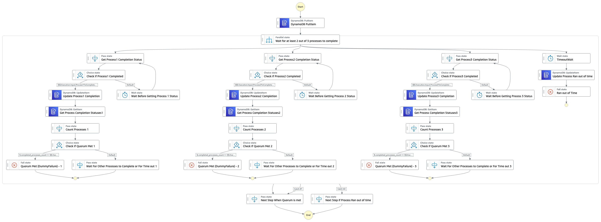

# Quorum With Parallel Pattern Workflow

This application will create a State Machine, and a DynamoDB Table. The State Machine shows a pattern where there are multiple processes running in parallel, but the state machine can proceed only if a minimum number of processes (a quorum) have completed. To achieve this it will use the execution id of the statem machine save to DDB a list of `processes_completed` as emnpty and `timeout_occurred` as false. 

As and when a process completes, it will udpate the processes_completed field in the DynamoDB entry and immediately check if the required number of processes have completed. If yes, it will break out of the Parallel State. It will not, it will wait for other processes to finish.

Learn more about this workflow at Step Functions workflows collection: << Add the live URL here >>

Important: this application uses various AWS services and there are costs associated with these services after the Free Tier usage - please see the [AWS Pricing page](https://aws.amazon.com/pricing/) for details. You are responsible for any AWS costs incurred. No warranty is implied in this example.

## Requirements

* [Create an AWS account](https://portal.aws.amazon.com/gp/aws/developer/registration/index.html) if you do not already have one and log in. The IAM user that you use must have sufficient permissions to make necessary AWS service calls and manage AWS resources.
* [AWS CLI](https://docs.aws.amazon.com/cli/latest/userguide/install-cliv2.html) installed and configured
* [Git Installed](https://git-scm.com/book/en/v2/Getting-Started-Installing-Git)
* [AWS Serverless Application Model](https://docs.aws.amazon.com/serverless-application-model/latest/developerguide/serverless-sam-cli-install.html) (AWS SAM) installed

## Deployment Instructions

1. Create a new directory, navigate to that directory in a terminal and clone the GitHub repository:
    ``` 
    git clone https://github.com/aws-samples/step-functions-workflows-collection
    ```
1. Change directory to the pattern directory:
    ```
    cd quorum-with-parallel-pattern
    ```
1. From the command line, use AWS SAM to deploy the AWS resources for the workflow as specified in the template.yaml file:
    ```
    sam deploy --guided
    ```
1. During the prompts:
    * Enter a stack name
    * Enter the desired AWS Region
    * Allow SAM CLI to create IAM roles with the required permissions.

    Once you have run `sam deploy --guided` mode once and saved arguments to a configuration file (samconfig.toml), you can use `sam deploy` in future to use these defaults.

1. Note the outputs from the SAM deployment process. These contain the resource names and/or ARNs which are used for testing.

## How it works

The pattern shows how to implement a parallel task in a way that if a "quorum" number of parallel flows finish, the execution will move out of the parallel step. It works in the following way.

- In this step functions workflow pattern, the first step is to log the current execution to DynamoDB.
- Then there is a parallel ststae with 4 parallel flows inside.
- One of them is a time out, while the other three are actual flows. For the purposes of this pattern I have added two but it can be any number.
- The time out flow waits for 15 seconds and completes the execution of the Parallel state if the quorum is not met by then.
- The other three flows use the following logic.
    - Check for any process to see if it completed (this is a Pass state in this pattern, but it could be any call to check, say, for RDS backup completion, or completion of an AWS Batch job triggered earlier, etc). If it is not completed, wait for 5 seconds and check again.
    - If the process completed, it will update the DynamoDB table with the name of the process.
    - After making the DynamoDB update, it checks the DynamoDB table to see if its completion causes the quorum to be met. It does by counting the processes completed against the "quorum" input passed to the workflow.
    - If the quorum is met it raise an "error", which is needed to break out of this parallel flow. For your business need this might not be an actual error scenario, but it is still implemented as an error, so that the flow can move out of the Parallel step
    - If the quorum is not met, it will just move forward waiting for other flows to complete. The idea is that each flow checks quorum after its own completion. So whichever flow's completion causes the quorum condition to be met will trigger an "error" and break out of the parallel state
- The Parallel state has 2 catch statement in its error handling, one to receive the time out error, and the other to receive the "error" thrown by the 3 flows. To reiterate, the "errors" by the 3 parallel flows are not actual errors in terms of your business logic but is just used to move control to outside the Parallel step.

## Image


## Testing

1. After deployment navigate to the AWS Step Functions console and select the `QuorumWithParallelWorkflowPattern` workflow. If you don't see it, make sure you are in the correct Region.

1. Select `Start Execution`, provide the input as
    ```
    {
        "Process1ToComplete" : true,
        "quorum" : 2
    }
    ```
    and then click `Start Execution`.

1. You will see that the task "Next Step If Process Ran out of time" gets executed because only 1 process completed.

1. Select `Start Execution` again, and this time provide the input as 
    ```
    {
        "Process1ToComplete" : true,
        "Process2ToComplete" : true,
        "quorum" : 2
    }
    ```
    and then click `Start Execution`.  

1. You will see that the task "Next Step If Quorum Is Met" gets executed because the quorum is 2 and the number of processes completed is 2.
1. Select `Start Execution` again, and this time use the default json and then click `Start Execution`.  
1. You will see that the task "Next Step If Process Ran out of time" gets executed because no process finishes before timeout.
1. Select `Start Execution` again, and this time provide the input as 
    ```
    {
        "Process1ToComplete" : true,
        "Process2ToComplete" : true,
        "Process3ToComplete" : true,
        "quorum" : 2
    }
    ```
    and then click `Start Execution`.  
1. You will see that the task "Next Step If Quorum Is Met" gets executed because the quorum is 2 and the number of processes completed is 3 (which is more than the quorum requirement).


## Cleanup
 
1. Delete the stack
    ```bash
    aws cloudformation delete-stack --stack-name STACK_NAME
    ```
1. Confirm the stack has been deleted
    ```bash
    aws cloudformation list-stacks --query "StackSummaries[?contains(StackName,'STACK_NAME')].StackStatus"
    ```
----
Copyright 2022 Amazon.com, Inc. or its affiliates. All Rights Reserved.

SPDX-License-Identifier: MIT-0
