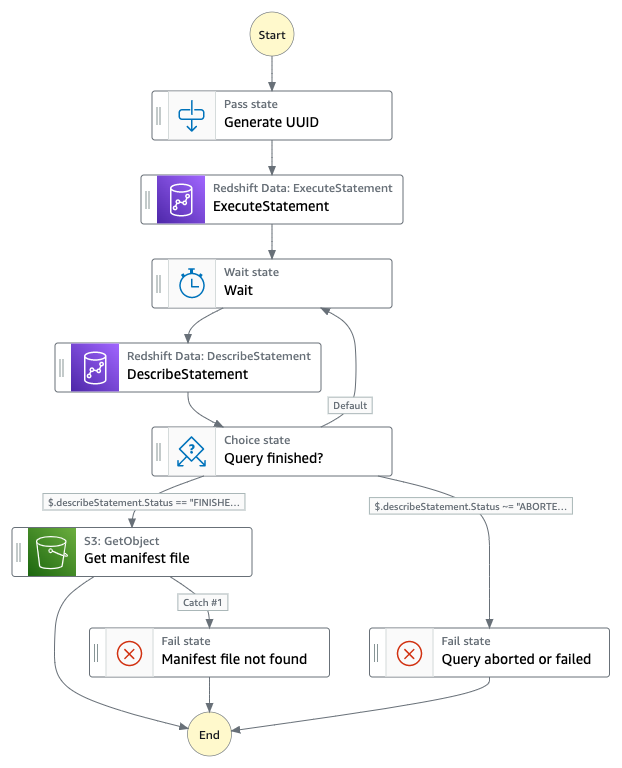

# Redshift Serverless UNLOAD

This workflow executes an UNLOAD query on [Amazon Redshift Serverless](https://aws.amazon.com/redshift/redshift-serverless/) via the [Amazon Redshift Data API](https://docs.aws.amazon.com/redshift/latest/mgmt/data-api.html) and stores the results in an [Amazon S3](https://aws.amazon.com/s3/) bucket. As input, this workflow expects the name of a Redshift Serverless [workgroup](https://docs.aws.amazon.com/redshift/latest/mgmt/serverless-workgroup-namespace.html), database, and the query to be executed. As output, this workflow provides a list of objects in S3 that contain the query results data.

The Redshift UNLOAD command unloads the result of a query to one or more text, JSON, or Apache Parquet files on Amazon S3, using Amazon S3 server-side encryption (SSE-S3). Learn more about the UNLOAD command in the [Amazon Redshift Database Developer Guide](https://docs.aws.amazon.com/redshift/latest/dg/r_UNLOAD.html).

Learn more about this workflow at Step Functions workflows collection: https://serverlessland.com/workflows/redshift-serverless-unload

Important: this application uses various AWS services and there are costs associated with these services after the Free Tier usage - please see the [AWS Pricing page](https://aws.amazon.com/pricing/) for details. You are responsible for any AWS costs incurred. No warranty is implied in this example.

## Requirements

- [Create an AWS account](https://portal.aws.amazon.com/gp/aws/developer/registration/index.html) if you do not already have one and log in. The IAM user that you use must have sufficient permissions to make necessary AWS service calls and manage AWS resources.
- [AWS CLI](https://docs.aws.amazon.com/cli/latest/userguide/install-cliv2.html) installed and configured
- [Git Installed](https://git-scm.com/book/en/v2/Getting-Started-Installing-Git)
- [AWS CDK](https://docs.aws.amazon.com/en_en/cdk/v2/guide/getting_started.html#getting_started_install) installed

## Deployment Instructions

1. Create a new directory, navigate to that directory in a terminal and clone the GitHub repository:
   ```
   git clone https://github.com/aws-samples/step-functions-workflows-collection
   ```
1. Change directory to the pattern directory:
   ```
   cd redshift-serverless-unload
   ```
1. From the command line, use AWS CDK to deploy the AWS resources for the workflow:
   ```
   npx cdk deploy
   ```

## How it works

The CDK stack contained in this repository deploys two AWS resources:

- An AWS Step Functions workflow that executes an UNLOAD query on Amazon Redshift Serverless.
- An Amazon S3 bucket that is used to store the results of the unload queries performed via the workflow.

The Step Functions workflow requires a Redshift Serverless workgroup, database, and query as input parameters. It performs the following tasks:

1. Initially, the workflow generates a uniqe ID for the workflow execution which will be used to store the results of each UNLOAD query performed via the Step Functions Workflow under a unique prefix in Amazon S3.
1. Next, the UNLOAD query is triggered via the Amazon Redshift Data API `ExecuteStatement` action and using the provided workflow input parameters.
1. To check if query execution has finished, the `DescribeStatement` API action is called repeatedly via a `Wait`state.
1. A `Choice` state evaluates of the query status has reached either `FINISHED`, `FAILED`, or `ABORTED`. Per default, the `Wait` state is set for 5 seconds.
1. If the query status returns as `FAILED` or `ABORTED`, the Step Functions workflow execution is terminated as a failure.
1. If the query status returns as `FINISHED`, the workflow attempts to get the Redshift UNLOAD manifest file from the S3 bucket that contains the results. The manifest file explicitly lists details for the data files that are created by the UNLOAD process. The manifest is a text file in JSON format that lists the URL of each file that was written to Amazon S3.
1. If the manifest file cannot be successfully retrieved, the workflow execution is terminated as a failure.
1. If the manifest file can be successfully retrieved, the workflow execution succeeds. The result of the execution contains the contents of the manifest file and, therefore, the location of each results file in the S3 bucket.

## Image



## Testing

To test this workflow, you need access to an Amazon Redshift Serverless workgroup and database. If you haven't setup Redshift Serverless yet, you can follow the [Getting started with Amazon Redshift Serverless and data loading](https://docs.aws.amazon.com/redshift/latest/gsg/serverless-first-time-setup.html) guide which will cover [initial setup](https://docs.aws.amazon.com/redshift/latest/gsg/serverless-console-getting-started-sample-data.html) and [loading a sample data set](https://docs.aws.amazon.com/redshift/latest/gsg/rs-serverless-console-query-sample-data.html).

After deploying the workflow, start an execution by providing the following input:

```json
{
  "redshift_workgroup": "default",
  "redshift_database": "sample_data_dev",
  "query_without_unload": "SELECT firstname, lastname, total_quantity FROM (SELECT buyerid, sum(qtysold) total_quantity FROM  tickit.sales GROUP BY buyerid ORDER BY total_quantity desc) Q, tickit.users WHERE Q.buyerid = userid ORDER BY Q.total_quantity desc;"
}
```

Note that the workflow expects only your raw query without the `UNLOAD` command prepended.

The result returned by the workflow lists the unloaded data files and their location in the results S3 bucket.

## Cleanup

From the workflow directory, run:

```bash
npx cdk destroy
```

---

Copyright 2022 Amazon.com, Inc. or its affiliates. All Rights Reserved.

SPDX-License-Identifier: MIT-0
