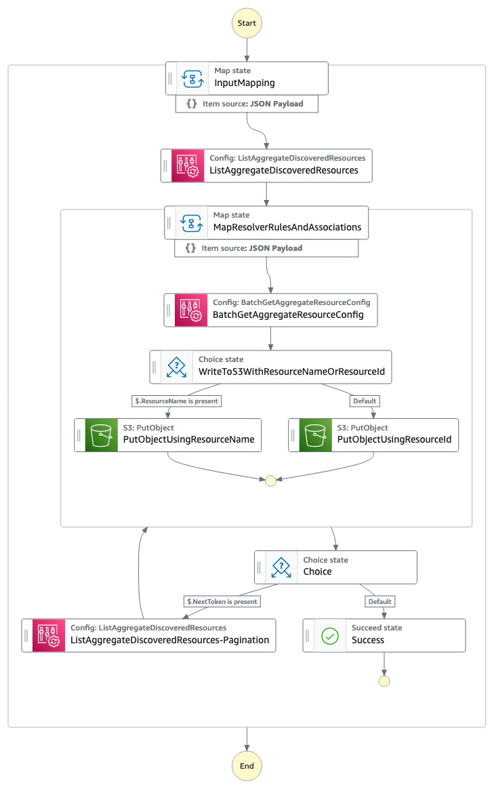

# A general purpose, low-code, Resource Configuration backup solution using an AWS Step Functions Workflow

`Low-Code`: This solution uses the AWS Step Functions AWS SDK integrations for AWS API actions.

`Configuration Backup`: This solution saves Resource-Type specific configurations to S3 in JSON format

`Invocation`: The Step Functions Workflow can be started using the AWS CLI, AWS SDK, the Console, or from another service (e.g. Amazon EventBridge, Amazon API Gateway).

`Prerequisite:` AWS Config must be active in your Account(s) and Region(s), as well as, an existing AWS Config Aggregator in the Account/Region which you are deploying this solution to. The name of this Aggregator will be needed as an input.

`Deployment`: The SAM template deploys one Step Functions workflow, creates a new S3 Bucket with SSE-AES256 to store the data in, calls an existing AWS Config Aggregator, and creates the minimum IAM resources required to run the application with logging enabled.

`Important:` this application uses various AWS services and there are costs associated with these services after the Free Tier usage - please see the [AWS Pricing page](https://aws.amazon.com/pricing/) for details. You are responsible for any AWS costs incurred. No warranty is implied in this example.

## Requirements

* [Create an AWS account](https://portal.aws.amazon.com/gp/aws/developer/registration/index.html) if you do not already have one and log in. The IAM user that you use must have sufficient permissions to make necessary AWS service calls and manage AWS resources.
* [AWS CLI Installed](https://docs.aws.amazon.com/cli/latest/userguide/install-cliv2.html) installed and configured
* [AWS SAM CLI Installed](https://docs.aws.amazon.com/serverless-application-model/latest/developerguide/serverless-sam-cli-install.html) 
* [Git Installed](https://git-scm.com/book/en/v2/Getting-Started-Installing-Git)
* [Setup an AWS Config Aggregator](https://docs.aws.amazon.com/config/latest/developerguide/aggregate-data.html)

## Deployment Instructions

- Clone this repository:
    ``` 
    git clone <Repository URL>
    ```
- CD to the cloned directory:
    ```
    cd <Respository Name>
    ```
-  Get the name of the existing AWS Config Aggregator in the Region that you are deploying this solution to as this will be needed as an input when invoking the solution:
    ```
    aws configservice describe-configuration-aggregators
    ```
- From the command line, use AWS SAM to deploy the AWS resources for the pattern as specified in the template.yml file:
    ```
    sam deploy --guided
    ```
- During the prompts:
    * Enter a stack name
    * Enter the desired AWS Region
    * Allow SAM CLI to create the Resources, including IAM roles, with the required permissions.

    Once you have run `sam deploy -guided` mode once and saved arguments to a configuration file (samconfig.toml), you can use `sam deploy` in future to use these defaults.

- Note the outputs from the SAM deployment process. These contain the resource names and/or ARNs which are used for testing.

## How it works




## Testing

Run the following AWS CLI command to send a `start-execution` comand to start the Step Functions workflow. Note, you must edit the Variable placeholders with the ARN of the deployed Step Functions workflow. `S3_BUCKET_NAME`, `STATE_MACHINE_ARN` will be provided in the stack outputs.
1. We will need to set the following variables before executing the workflow:  
    `S3_BUCKET_NAME`= String, Name of a new S3 Bucket to be created to store the resource configuration snapshots in  
    `STATE_MACHINE_ARN`= String, ARN of the created State Machine where the solution was deployed  
    `CONFIG_AGGREGATOR_NAME`= String, Name of an existing AWS Config Aggregator in the Account and Region where the solution was deployed  
    `RESOURCE_TYPES_TO_LOOKUP`= String, String-List of AWS Resource Types to lookup configuration for (provide up-to 5)  

2. Set the variables, then use `jq` to create a JSON payload which will be passed into the AWS CLI call to trigger the State Machine:
    ```bash
    S3_BUCKET_NAME=""
    STATE_MACHINE_ARN=""
    CONFIG_AGGREGATOR_NAME=""
    RESOURCE_TYPES_TO_LOOKUP='["AWS::Route53::HostedZone","AWS::EC2::TransitGatewayRouteTable"]'
    
    JSON_CLI=$( jq -n \
        --arg bucket "$S3_BUCKET_NAME" \
        --arg aggregator "$CONFIG_AGGREGATOR_NAME" \
        --argjson types "$RESOURCE_TYPES_TO_LOOKUP" \
        '{ResourceTypesToLookup: $types, ConfigAggregatorName: $aggregator, PaginationLimit: 100, S3BucketName: $bucket}' )

    aws stepfunctions start-execution  --name "test" --state-machine-arn ${STATE_MACHINE_ARN} --input $JSON_CLI
    ```
3. The Workflow will execute and the output will show an execution ARN
4. From the AWS console, review the AWS Step Functions to see the state of the executed workflow at any time. Alternatively, use the AWS CLI to check the status by providing the executionARN value from the start-execution API call: `aws stepfunctions list-executions --state-machine-arn <executionArn>`
4. After the Workflow has completed successfully, check the S3 Bucket to review the saved configurations. You can also view the CloudWatch Log Group, the name of the Log Group is provided in the stack outputs.


### Example output on the CLI of a successful workflow start:

```
    {
        "executionArn": "arn:aws:states:<region>:<accountId>:express:StateMachine-AbGSUE23kS22:test:<hash>",
        "startDate": "2023-10-09T23:20:51.743000-05:00"
    }
```

### Example of the data saved in S3:


```bash
# S3 Partitioning Structure:
<bucketName>
|__config-snapshots-by-date
|____<YYYY-MM-DD>
|______<accountId>
|________<region>
|__________<resourceType>
|____________<resource>
|________________<resourceName or resourceId>.json

# Example:
storage-config-snapshots-bucket
|__config-snapshots-by-date
|____2023-12-01
|______123456789012
|________us-west-2
|__________Route53
|____________HostedZone
|______________app1.local..json
|______________app2.local..json

```


Example data:  

`Route53/HostedZone/<resource>.json`
 ```json
    {
        "AccountId": "<accountId>",
        "Arn": "arn:aws:route53:::hostedzone/<zoneId>",
        "AvailabilityZone": "Not Applicable",
        "AwsRegion": "<region>",
        "Configuration": "{\"Id\":\"<zoneId>\",\"HostedZoneConfig\":{},\"Name\":\"<zoneName>\",\"VPCs\":[{\"VPCId\":\"vpc-12345\",\"VPCRegion\":\"<region>\"}],\"HostedZoneTags\":[]}",
        "ConfigurationItemCaptureTime": "2023-10-15T12:00:00.151Z",
        "ConfigurationItemStatus": "OK",
        "ConfigurationStateId": "<stateId>",
        "ResourceId": "<resourceId>",
        "ResourceName": "<zoneName",
        "ResourceType": "AWS::Route53::HostedZone",
        "SupplementaryConfiguration": {},
        "Version": "1.3"
    }
  ```
------

`EC2/RouteTable/<resource>.json`

```json
{
    "AccountId": "<accountId>",
    "Arn": "arn:aws:ec2:<region>:<accountId>:route-table/rtb-<id>",
    "AvailabilityZone": "Not Applicable",
    "AwsRegion": "<region>",
    "Configuration": "{\"associations\":[{\"main\":false,\"routeTableAssociationId\":\"rtbassoc-<id>\",\"routeTableId\":\"rtb-<id>\",\"subnetId\":\"subnet-<id>\",\"gatewayId\":null, \"associationState\":{\"state\":\"associated\",\"statusMessage\":null}},{\"main\":false,\"routeTableAssociationId\":\"rtbassoc-<id>\",\"routeTableId\":\"rtb-<id>\", ...}",
    "ConfigurationItemCaptureTime": "2023-10-30T02:00:00.130Z",
    "ConfigurationItemStatus": "OK",
    "ConfigurationStateId": "<stateId>",
    "ResourceId": "rtb-<id>",
    "ResourceType": "AWS::EC2::RouteTable",
    "SupplementaryConfiguration": {},
    "Version": "1.3"
}    
```
- When required, the `Configuration` nested JSON String data, from the output above, can be further cleaned up using tools such as `jq` from the CLI. For example:  
    ```bash
    # Set a Variable equal to the JSON data, surrounded by single-quotes to represent a String, then use 'jq'
    json='{"AccountId": "<accountId>", "Arn": "...", "Configuration": "{\"associations\": ...}", ..."Version":"1.3"}'  
    echo $json | jq '.Configuration | fromjson'  
    ```

- The output from the previous commands will be a JSON Object of the `Configuration`. For example:  
    ```json
    {
        "associations": [
         {
            "main": false,
            "routeTableAssociationId": "rtbassoc-<id>",
            "routeTableId": "rtb-<id>",
            "subnetId": "subnet-<id>",
            "gatewayId": null,
            "associationState": {
                "state": "associated",
                "statusMessage": null
            }
           "etc": "..."
         }
         "etc": "..."
        ]
       "etc": "..."
    }
    ```
    

## Cleanup
 

Delete the stack using SAM CLI
```bash
sam delete
```


Resolving the AWS CloudFormation `DELETE_FAILED` Error for a non-empty S3 Bucket:  
>
>If you see an Error such as the following: `The following resource(s) failed to delete: [S3StorageBucket]`, then either this Bucket will have to manually emptied and deleted if it's no longer needed, or, alternatively, from the CloudFormation Console or the CLI, when manually deleting the Stack, you can choose to retain the S3 Bucket. See AWS CLI documentation https://awscli.amazonaws.com/v2/documentation/api/latest/reference/cloudformation/delete-stack.html
  ```bash
  aws cloudformation delete-stack --stack <stackName> --retain-resources S3StorageBucket
  ```
----
Copyright 2023 Amazon.com, Inc. or its affiliates. All Rights Reserved.

SPDX-License-Identifier: MIT-0