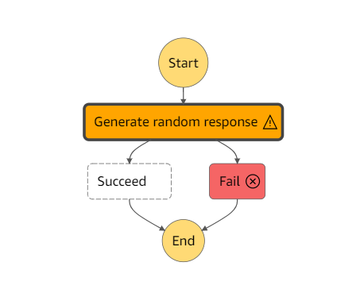
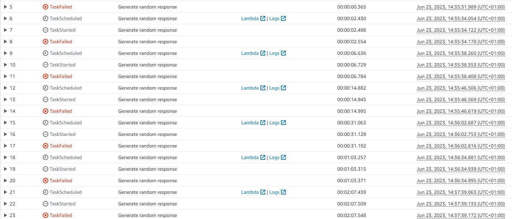
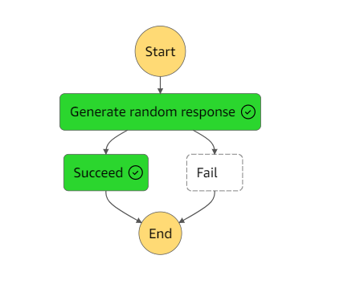
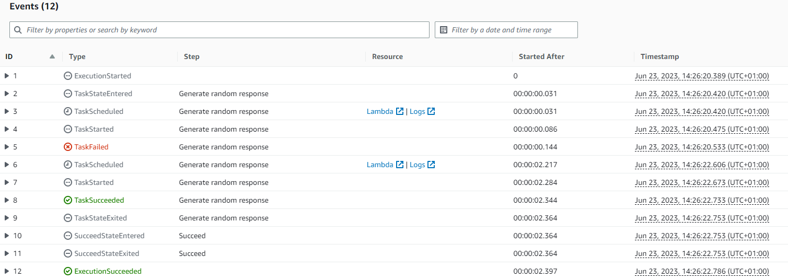
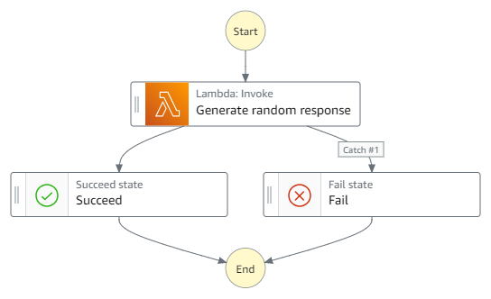

# Retry with Exponential Backoff

This workflow demonstrates how to implement automatic retries with increasing delays to handle transient failures gracefully.

Learn more about this workflow at Step Functions workflows collection: https://serverlessland.com/workflows/retry-with-exponential-backoff

For more information about error handling with Step Functions, please read the [Step Functions Developer Guide](https://docs.aws.amazon.com/step-functions/latest/dg/concepts-error-handling.html)

Important: this application uses various AWS services and there are costs associated with these services after the Free Tier usage - please see the [AWS Pricing page](https://aws.amazon.com/pricing/) for details. You are responsible for any AWS costs incurred. No warranty is implied in this example.

## Requirements

* [Create an AWS account](https://portal.aws.amazon.com/gp/aws/developer/registration/index.html) if you do not already have one and log in. The IAM user that you use must have sufficient permissions to make necessary AWS service calls and manage AWS resources.
* [AWS CLI](https://docs.aws.amazon.com/cli/latest/userguide/install-cliv2.html) installed and configured
* [Git Installed](https://git-scm.com/book/en/v2/Getting-Started-Installing-Git)
* [AWS Serverless Application Model](https://docs.aws.amazon.com/serverless-application-model/latest/developerguide/serverless-sam-cli-install.html) (AWS SAM) installed

## Deployment Instructions

1. Create a new directory, navigate to that directory in a terminal and clone the GitHub repository:
    ``` 
    git clone https://github.com/aws-samples/step-functions-workflows-collection
    ```
1. Change directory to the pattern directory:
    ```
    cd retry-with-exponential-backoff-sam
    ```
1. From the command line, use AWS SAM to deploy the AWS resources for the workflow as specified in the template.yaml file:
    ```
    sam deploy --guided
    ```
1. During the prompts:
    * Enter a stack name
    * Enter the desired AWS Region
    * Allow SAM CLI to create IAM roles with the required permissions.

    Once you have run `sam deploy --guided` mode once and saved arguments to a configuration file (samconfig.toml), you can use `sam deploy` in future to use these defaults.

## How it works

The workflow invokes a Lambda function which produces random results. This step is configured to `Retry` for certain transient errors such as `Lambda.TooManyRequestsException` and a custom `InternalServerError`. The `Retry` is configured with a `BackoffRate` of 2, which is the multiplier by which the retry interval denoted by `IntervalSeconds` increases after each retry attempt, resulting in an exponential backoff of the retries. Other errors such as `BadRequest` cause the State Machine to move to the Fail step as they are not recoverable.

### Failure Scenario
This image illustrates a failed execution and the detailed events below. The `Generate random response` step retries when an `InternalServerError` is recieved. Each subsequent retry occurs at a multiple of 2 of the previous retry, so the first retry occurs 2 seconds after the first `TaskFailed`, the second retry after 4 seconds (`IntervalSeconds` * `BackoffRate`), the IntervalSeconds is now 4 so the next retry occurs after 8 seconds and the `IntervalSeconds` continues to double until the `MaxAttempts` of 6 is reached.



### Recovered Scenario
This image illustrates a recovered execution and the detailed events below. After an initial `InternalServerError` is recieved, a retry occurs after 2 seconds and a successful response is recieved.



## Image


## Testing

You can test the workflow and view the results visually from the [Step Functions console](https://console.aws.amazon.com/states/home)

## Cleanup
 
1. Delete the stack
    ```bash
    sam delete
    ```
----
Copyright 2023 Amazon.com, Inc. or its affiliates. All Rights Reserved.

SPDX-License-Identifier: MIT-0
