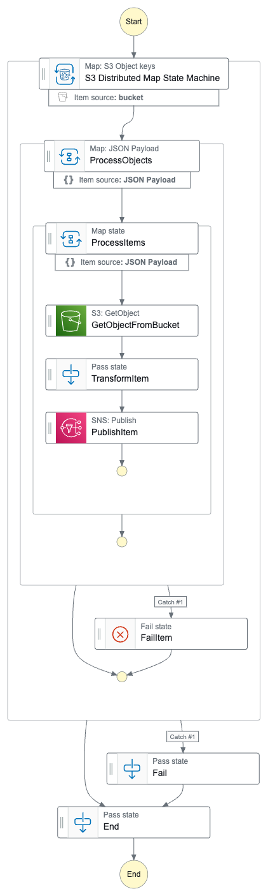

# S3 High Throughput Distributed Map

This is an AWS CDK template for exploring the Step Functions Distributed Map capabilities and how to tackle the need of an increased paralelism.

Amazon S3 is highly used as a durable and highly available service to store big amount of data for audit, compliance , application or datafication purposes. The challenge of using these data begins in read and parallelization steps, this can be handled by an optimized custom code using aws services like AWS Lambda or AWS Batch but in simple scenarios when the bigest part of this process is read and paralleism level the challenge can be handled using Step function Distributed map. 

This example is realized following the official [Aws Documentation](https://docs.aws.amazon.com/step-functions/latest/dg/use-dist-map-orchestrate-large-scale-parallel-workloads.html) and the consideration and concepts explored in [AWS Blog News](https://aws.amazon.com/blogs/aws/step-functions-distributed-map-a-serverless-solution-for-large-scale-parallel-data-processing).

Learn more about this workflow at Step Functions workflows collection: https://serverlessland.com/workflows/s3-high-throughput-distributed-map

Important: this application uses various AWS services and there are costs associated with these services after the Free Tier usage - please see the [AWS Pricing page](https://aws.amazon.com/pricing/) for details. You are responsible for any AWS costs incurred. No warranty is implied in this example.


## Requirements

* [Create an AWS account](https://portal.aws.amazon.com/gp/aws/developer/registration/index.html) if you do not already have one and log in. The IAM user that you use must have sufficient permissions to make necessary AWS service calls and manage AWS resources.
* [AWS CLI](https://docs.aws.amazon.com/cli/latest/userguide/install-cliv2.html) installed and configured
* [Git Installed](https://git-scm.com/book/en/v2/Getting-Started-Installing-Git)
* [AWS CDK Installed](https://docs.aws.amazon.com/cdk/v2/guide/getting_started.html#getting_started_install)

## Deployment Instructions

1. If this is your first time using AWS CDK, bootstrap your [environment](https://docs.aws.amazon.com/cdk/v2/guide/getting_started.html#getting_started_bootstrap).

    ```bash
    cdk bootstrap aws://{your-aws-account-number}/{your-aws-region}
    ```

2. Create a new directory, navigate to that directory in a terminal and clone the GitHub repository:

    ```bash
    git clone https://github.com/aws-samples/step-functions-workflows-collection
    ```

3. Change directory to the pattern directory:

    ```bash
    cd s3-high-throughput-distributed-map
    ```

4. From the command line, use npm to install dependencies and run the build process for the Lambda functions.

    ```bash
    npm install
    npm run build
    ```

5. From the command line, use CDK to deploy the AWS resources for the workflow

    ```bash
    npm run cdk:deploy
    ```

6. During the prompts:

    ```text
    Do you wish to deploy these changes (y/n)? Y
    ```

## How it works

This Sample Deploy json files from `ressources/assets` folder into the S3 Bucket, to run the example for higher throughput just add more json files and redeploy the sample ( this can lead to costs ).

Run this command to create a high number of files before deployment

```shell
    cd resources/assets && for i in {1..100000}; do cp example1.json "example$i.json"; done

     aws s3 sync . s3://<S3-Bucket-Name>
```

This step function demonstrates oprimized treatment of s3 objects with native service integrations:

1. Read all S3 bucket objects using a parent DISTRIBUTED map.
2. Batching and Sending each batch to a parallel map branch.
3. Parallelizing each sent batch using a child DISTRIBUTED Map.  
4. Rebatching and parallelizing the items using an INLINE map
5. Geting the Object Body from S3 for any single Key
6. Transforming the body by adding a new attribute in json body
7. Publishing the transformed results to Amazon SNS Topic


## Image



## Testing

The Step Function can be triggered without worring about payload
