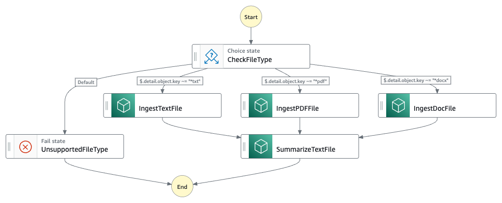

# Serverless Document Summarization with Bedrock

This workflow demonstrates how to use an AWS Step Functions state machine to orchestrate S3 object summarization using Amazon Bedrock.

Learn more about this workflow at Step Functions workflows collection: https://github.com/aws-samples/step-functions-workflows-collection/s3-sfn-lambda-bedrock

Important: this application uses various AWS services and there are costs associated with these services after the Free Tier usage - please see the [AWS Pricing page](https://aws.amazon.com/pricing/) for details. You are responsible for any AWS costs incurred. No warranty is implied in this example.

## Requirements

* [Create an AWS account](https://portal.aws.amazon.com/gp/aws/developer/registration/index.html) if you do not already have one and log in. The IAM user that you use must have sufficient permissions to make necessary AWS service calls and manage AWS resources.
* [AWS CLI](https://docs.aws.amazon.com/cli/latest/userguide/install-cliv2.html) installed and configured
* [Git Installed](https://git-scm.com/book/en/v2/Getting-Started-Installing-Git)
* [AWS Serverless Application Model](https://docs.aws.amazon.com/serverless-application-model/latest/developerguide/serverless-sam-cli-install.html) (AWS SAM) installed

## Deployment Instructions

1. Create a new directory, navigate to that directory in a terminal and clone the GitHub repository:
    ```
    git clone https://github.com/aws-samples/step-functions-workflows-collection
    ```
1. Change directory to the pattern directory:
    ```
    cd step-functions-workflows-collection/s3-sfn-lambda-bedrock
    ```
1. From the command line, use AWS SAM to build and deploy the AWS resources for the workflow as specified in the template.yaml file:
    ```
    sam build
    sam deploy --guided
    ```
1. During the prompts:
    * Enter a stack name
    * Enter the desired AWS Region
    * Allow SAM CLI to create IAM roles with the required permissions.
    * For the parameter `RawPrefix`, enter the prefix for the input files (default: "raw/")
    * For the parameter `CleanedPrefix`, enter the prefix for the cleaned text files (default: "cleaned/")
    * For the parameter `CuratedPrefix`, enter the prefix for the summarized files (default: "curated/")
    * For the parameter `BedrockPrompt`, enter the prompt to provide to Bedrock for summarization (default: "You are a business analyst. Review the following content and produce a concise summary for an executive. Also, generate tags that can be used to find the content in a search or word cloud: ")

    Once you have run `sam deploy --guided` mode once and saved arguments to a configuration file (samconfig.toml), you can use `sam deploy` in future to use these defaults.

## How it works

This sample project demonstrates how to use an AWS Step Functions state machine to orchestrate S3 object summarization using Amazon Bedrock. The state machine is triggered by new file uploads to an S3 bucket with the prefix "raw/". It coordinates the execution of Lambda functions to process and summarize the documents.

The state machine first checks the file type (txt, pdf, or docx) and invokes the appropriate Lambda function to extract the text content. The extracted text is stored in the same S3 bucket with the prefix "cleaned/". This cleaned text is then passed to another Lambda function that leverages Amazon Bedrock's natural language processing capabilities to generate a concise summary.

The generated summary is stored in the original S3 bucket with the prefix "curated/", providing users with a convenient way to access the key information from large documents without having to read through the entire content.

## Image


## Testing

To test the workflow, upload a txt, pdf, or docx file to the S3 bucket created during deployment (with the prefix "raw/"). The Step Functions workflow should trigger and execute the appropriate Lambda functions to extract the text content and generate a summary using Bedrock. The summarized content will be stored in the same S3 bucket with the prefix "curated/".

You can monitor the execution of the Step Functions workflow in the AWS Step Functions console and view the logs for each Lambda function invocation in the AWS CloudWatch Logs console.

## Cleanup

1. Delete the stack
    ```bash
    sam delete
    ```

----
Copyright 2022 Amazon.com, Inc. or its affiliates. All Rights Reserved.

SPDX-License-Identifier: MIT-0

