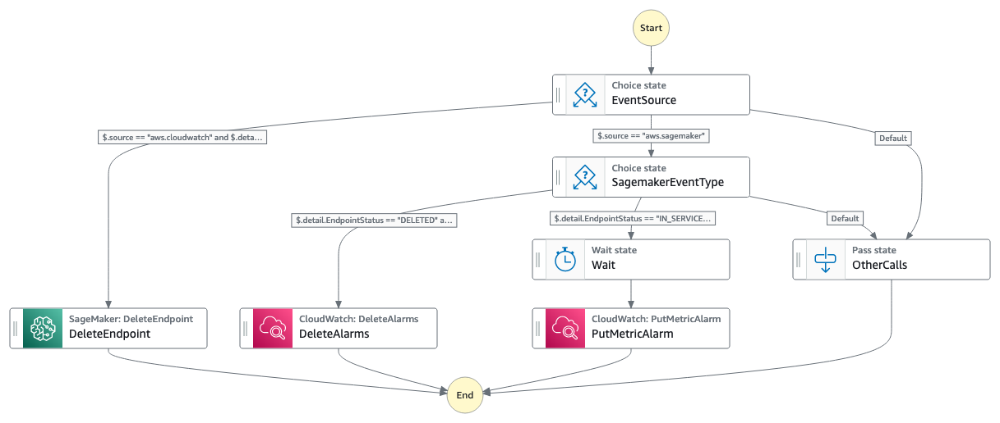

# sagemaker-endpoint-maintainer

This workflow showcases how StepFunctions can provide a LowCode method to cleaning up idle resources. Data Scientists often deploy endpoints on large instances, this method demonstrates auto-maintenance by cleaning up underutilized resources. There are four ways to execute Sagemaker Inferencing, Realtime Inference, Async Inference, Batch Inference and Serverless Inference. In this workflow we are focusing on maintenance of Realtime Inference Endpoints. 

Important: this application uses various AWS services and there are costs associated with these services after the Free Tier usage - please see the [AWS Pricing page](https://aws.amazon.com/pricing/) for details. You are responsible for any AWS costs incurred. No warranty is implied in this example.

## Requirements

* [Create an AWS account](https://portal.aws.amazon.com/gp/aws/developer/registration/index.html) if you do not already have one and log in. The IAM user that you use must have sufficient permissions to make necessary AWS service calls and manage AWS resources.
* [AWS CLI](https://docs.aws.amazon.com/cli/latest/userguide/install-cliv2.html) installed and configured
* [Git Installed](https://git-scm.com/book/en/v2/Getting-Started-Installing-Git)
* [AWS Serverless Application Model](https://docs.aws.amazon.com/serverless-application-model/latest/developerguide/serverless-sam-cli-install.html) (AWS SAM) installed

## Deployment Instructions

1. Create a new directory, navigate to that directory in a terminal and clone the GitHub repository:
    ``` 
    git clone https://github.com/aws-samples/step-functions-workflows-collection
    ```
2. Change directory to the pattern directory:
    ```
    cd sagemaker-endpoint-maintainer
    ```
3. From the command line, use AWS CDK to deploy the AWS resources for the workflow:
    ```
    npx cdk deploy
    ```

## How it works

The Workflows main actions are invoked through Eventbridge for Sagemaker and Cloudwatch events. It deploys Cloudwatch Alarms for any tagged Sagemaker Inference Endpoint.

The implementation of the Workflow requires an AWS TAG `auto-maintain` to be attached to Sagemaker Inference Endpoints. In a real scenario, this TAG can be changed to your Development account. This would ensure production resources are not affected by times of inactivity. 

```python
model_predictor = model.deploy(
    initial_instance_count=1,
    instance_type=inference_instance_type,
    predictor_cls=Predictor,
    endpoint_name=endpoint_name,
    tags = [{'Key': 'auto-maintain', 'Value':'true'}]
)
```

A sample [Python Notebook](/sample.ipynb) can be used for reference to setup and deploy a Large Language Model. It has prerequisites from Huggingface and then deploys the model and configures an interface. The last cell contains a cleanup action which can be invoked at the very end to cleanup the Endpoint Configuration. It has been tested in Sagemaker Studio.

Flow:

* When a `Sagemaker Endpoint State Change` event is received with status `IN_SERVICE` the workflow configures a Cloudwatch Alarm 
* The Cloudwatch Alarm is pre-configured for a short time window of 5 minutes with three evaluation periods, this can be extended in real scenarios to fit the lifecycle requirements for the Sagemaker Inference Endpoint
* The StepFunction has a Wait period pre-configured to 5 minutes, this should be adjusted to the same configuration as the Cloudwatch Alarm. This is to give a grace period to when the Alarms should trigger and give the Developer time to interact with the Endpoint
* Once the Cloudwatch Alarm triggers, Eventbridge notifies the Workflow to decommission the Sagemaker Inference Endpoint through the Sagemaker DeleteEndpoint API call
* When Eventbridge detects the Sagemaker DeleteEndpoint API call it forwards a Cloudwatch DeleteAlarm to remove the orphaned Alarm 
 
## Image
Provide an exported .png of the workflow in the `/resources` directory from [Workflow studio](https://docs.aws.amazon.com/step-functions/latest/dg/workflow-studio.html) and add here.



## Testing

The example [Python Notebook](/sample.ipynb) requires Sagemaker Studio or a similar execution environment for testing. Upload the notebook to Studio and review the code to understand what it executes. The deployment requires an instance with enough memory for LLM but it does not require payloads to be returned from Inference Endpoint. We are just testing Cloudwatch metrics for Invocations. When there are no Invocations detected, the Workflow cleans up the deployed Endpoint. 

1. Execute all cells from [Python Notebook](/sample.ipynb) in Sagemaker Studio except the last cell which executes the Interface and Model Cleanup
2. After roughly 10 minutes there should be a Inference Endpoint  


Notes: 
1. When cleaning up your Environment, review that Sagemaker Inference Endpoint Configurations are also cleaned up. Either by execution the cell or manual cleanup. It is purposely left out of the Workflow as Data Scientist may want to redeploy Interfaces with their previous configuration.

```
removalPolicy: cdk.RemovalPolicy.DESTROY,
autoDeleteObjects: true,
```

## Cleanup

From the pattern directory, run
 
1. Delete the stack
    ```bash
    npx cdk destroy
    ```

----
Copyright 2022 Amazon.com, Inc. or its affiliates. All Rights Reserved.

SPDX-License-Identifier: MIT-0
