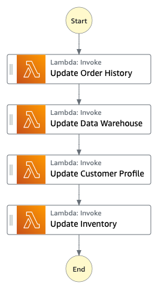

# Nested Workflows

Combine Standard and Express Workflows by running a mock e-commerce workflow that does selective checkpointing (Nested workflows). Deploying this sample project creates a Standard workflows state machine, a nested Express Workflows state machine, an AWS Lambda function, an Amazon Simple Queue Service (Amazon SQS) queue, and an Amazon Simple Notification Service (Amazon SNS) topic.

Browse through this example state machine to see how Step Functions processes input from Amazon SQS and Amazon SNS, and then uses a nested Express Workflows state machine to update backend systems.

The child state machine in this sample project updates backend information when called by the parent state machine.

## Requirements

* [Create an AWS account](https://portal.aws.amazon.com/gp/aws/developer/registration/index.html) if you do not already have one and log in. The IAM user that you use must have sufficient permissions to make necessary AWS service calls and manage AWS resources.
* [AWS CLI](https://docs.aws.amazon.com/cli/latest/userguide/install-cliv2.html) installed and configured
* [Git Installed](https://git-scm.com/book/en/v2/Getting-Started-Installing-Git)
* [AWS CDK Installed](https://docs.aws.amazon.com/cdk/v2/guide/getting_started.html#getting_started_install)

## Deployment Instructions

1. If this is your first time using AWS CDK, bootstrap your [environment](https://docs.aws.amazon.com/cdk/v2/guide/getting_started.html#getting_started_bootstrap).

    ```bash
    cdk bootstrap aws://{your-aws-account-number}/{your-aws-region}
    ```

1. Create a new directory, navigate to that directory in a terminal and clone the GitHub repository:

    ```bash
    git clone https://github.com/aws-samples/step-functions-workflows-collection
    ```

1. Change directory to the pattern directory:

    ```bash
    cd selective-checkpointing-cdk/typescript
    ```

1. From the command line, use npm to install dependencies and run the build process.

    ```bash
    npm install
    npm run build
    ```

1. From the command line, use CDK to deploy the AWS resources for the workflow as specified in the ```index.ts``` file:

    ```bash
    cdk deploy
    ```
   
## Testing

1. Deploy the State Machine via CDK using the instructions above.
1. Start an execution of the parent state machine. You should be able to trace the parent workflow from start to finish including the child workflow illustrating the update to backend systems.




## Cleanup

To delete the resources created by this template:

1. Delete the stack

    ```bash
    cdk destroy
    ```

1. During the prompts:

    ```bash
        Are you sure you want to delete: SelectiveCheckpointingStack (y/n)? Y
    ```

---

Copyright 2022 Amazon.com, Inc. or its affiliates. All Rights Reserved.

SPDX-License-Identifier: MIT-0
