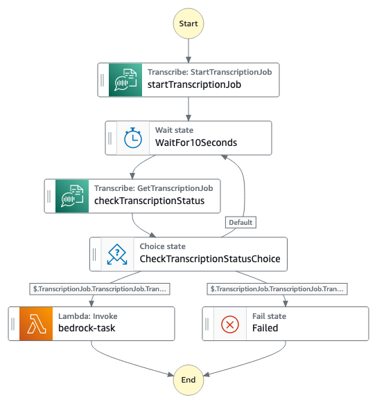

# Serverlessly generate video content summarization with Amazon Bedrwock

In this use case, users upload meeting recordings via a UI. This UI is hosted on an S3 bucket and delivered through Amazon CloudFront. When a video is uploaded, it triggers an AWS account event. Amazon EventBridge captures this event. The system either transcodes the video for Amazon Transcribe or directly feeds it if already compatible.

Amazon Transcribe then creates a transcription of the video. This transcription serves as the input for an Amazon Bedrock API request. We use the Jurassic-2 Ultra model from AI21 Lab to summarize the transcript. The summary is stored in DynamoDB. Users can access it on the UI using the video ID.

Additionally, there's an error-handling component. An AWS Lambda function handles errors. It's triggered by Amazon EventBridge rules. These rules detect failures from AWS services, like Amazon MediaConvert failing to convert a video.


## Requirements

* [Create an AWS account](https://portal.aws.amazon.com/gp/aws/developer/registration/index.html) if you do not already have one and log in. The IAM user you use must have sufficient permissions to make necessary AWS service calls and manage AWS resources.
* [AWS CLI](https://docs.aws.amazon.com/cli/latest/userguide/install-cliv2.html) installed and configured
* [Git Installed](https://git-scm.com/book/en/v2/Getting-Started-Installing-Git)
* [AWS CDK Installed](https://docs.aws.amazon.com/cdk/v2/guide/getting_started.html#getting_started_install)
* [Amazon Bedrock Foundation Model Access](https://docs.aws.amazon.com/bedrock/latest/userguide/model-access.html)


## Deployment Instructions

1. If this is your first time using AWS CDK, bootstrap your [environment](https://docs.aws.amazon.com/cdk/v2/guide/getting_started.html#getting_started_bootstrap).

    ```bash
    cdk bootstrap aws://{your-aws-account-number}/{your-aws-region}
    ```

2. Create a new directory, navigate to that directory in a terminal, and clone the GitHub repository:

    ```bash
    git clone https://github.com/aws-samples/step-functions-workflows-collection.git
    ```

3. Change directory to the pattern directory:

    ```bash
    cd serverless-bedrock-video-content-summary/typescript
    ```

4. Modify the input of `sharedResourcesStack`, replace the `subEmail` variable with your own Email address:
    ```typescript
    const sharedResourcesStack = new SharedResourcesStack(app, 'SharedResourcesStack', {
        subEmail: 'you@email.address', // <- replace with your Email
        env: env
    });
    ```
5. To create a layer for lambda function to invoke Bedrock service, you will firstly need to run `pip` command to install `boto3==1.28.57` to directry `typescript/resource/layers/bedrock-layer/python` with command below: 
   ```bash 
   pip install -r requirements.txt --target resource/layers/bedrock-layer/python
   ```
6. From the command line, use npm to install dependencies and run the build process for the Lambda functions.

    ```bash
    npm install
    npm run build
    ```

7. From the command line, use CDK to deploy the AWS resources for the workflow as specified in the TypeScript files under `/lib` and `/bin/vod-workflow.ts`:

    ```bash
    cdk deploy --all
    ```


## Images


## Clean up
Delete the stack: 
    ```bash
    cdk destroy --all 
    ```

During the process: 
    ```
    Are you sure you want to delete: DeliverChannelStack, MediaTranscodeStack, ErrorHandlerStack, SharedResourcesStack (y/n)? y
    ```