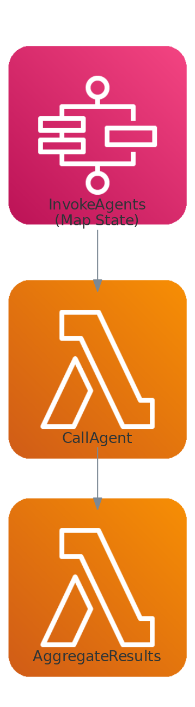

# Step Functions with Bedrock AgentCore Multi-Agent Orchestration

This workflow deploys an AWS Step Functions state machine that orchestrates multiple Bedrock AgentCore agents in parallel, then aggregates their responses into a unified summary using Amazon Bedrock Converse.

Learn more about this workflow at Step Functions workflows collection: https://serverlessland.com/workflows/sfn-agentcore-bedrock-cdk

Important: this application uses various AWS services and there are costs associated with these services after the Free Tier usage - please see the [AWS Pricing page](https://aws.amazon.com/pricing/) for details. You are responsible for any AWS costs incurred. No warranty is implied in this example.

## Requirements

* [Create an AWS account](https://portal.aws.amazon.com/gp/aws/developer/registration/index.html) if you do not already have one and log in. The IAM user that you use must have sufficient permissions to make necessary AWS service calls and manage AWS resources.
* [AWS CLI](https://docs.aws.amazon.com/cli/latest/userguide/install-cliv2.html) installed and configured
* [Git Installed](https://git-scm.com/book/en/v2/Getting-Started-Installing-Git)
* [Node.js 18+](https://nodejs.org/en/download/) installed
* [AWS CDK v2](https://docs.aws.amazon.com/cdk/v2/guide/getting-started.html) installed
* [Amazon Bedrock model access](https://docs.aws.amazon.com/bedrock/latest/userguide/model-access.html) enabled for your chosen model (default: Claude Sonnet) in your target region
* One or more [Bedrock AgentCore agent runtimes](https://docs.aws.amazon.com/bedrock/latest/userguide/agentcore.html) already deployed and accessible

## Deployment Instructions

1. Create a new directory, navigate to that directory in a terminal and clone the GitHub repository:
    ```
    git clone https://github.com/aws-samples/step-functions-workflows-collection
    ```
1. Change directory to the pattern directory:
    ```
    cd step-functions-workflows-collection/sfn-agentcore-bedrock-cdk
    ```
1. Install dependencies:
    ```
    npm install
    ```
1. Deploy the stack with your AgentCore runtime ARNs:
    ```
    cdk deploy \
      --parameters AgentRuntimeArns=arn:aws:bedrock-agentcore:us-east-1:123456789012:runtime/agent1,arn:aws:bedrock-agentcore:us-east-1:123456789012:runtime/agent2 \
      --parameters BedrockModelId=us.anthropic.claude-sonnet-4-20250514-v1:0
    ```
1. Note the outputs from the CDK deployment process. These contain the resource names and/or ARNs which are used for testing.

## How it works

1. The **Trigger Lambda** receives a prompt and a list of AgentCore runtime ARNs, then starts the Step Functions state machine execution.
2. The **Map state** fans out to invoke each AgentCore agent in parallel. Each iteration calls the **Invoke Agent Lambda**, which uses the bundled `@aws-sdk/client-bedrock-agentcore` SDK to call `InvokeAgentRuntime` and collect the streaming response.
3. After all agents respond, the **Aggregate Lambda** uses Amazon Bedrock Converse (Claude) to synthesize all agent responses into a single coherent summary.
4. The state machine returns the aggregated summary along with the agent count.

### Important Notes

- **Bundled SDK**: The `@aws-sdk/client-bedrock-agentcore` package is not included in the Lambda runtime. The invoke-agent function uses `NodejsFunction` with esbuild bundling to include it.
- **Streaming Response**: `InvokeAgentRuntime` returns a streaming response, which cannot be consumed directly by Step Functions SDK integrations. A Lambda intermediary collects the stream and returns the full response.
- **Enforced Guardrails**: If your account has account-level enforced guardrails configured, all roles that call Bedrock must have `bedrock:ApplyGuardrail` permission.

## Image



## Testing

1. Invoke the trigger function with a prompt and your agent runtime ARNs:
    ```bash
    aws lambda invoke \
      --function-name <TriggerFunctionName> \
      --payload '{
        "prompt": "What are the best practices for building serverless applications?",
        "agentRuntimeArns": [
          "arn:aws:bedrock-agentcore:us-east-1:123456789012:runtime/agent1",
          "arn:aws:bedrock-agentcore:us-east-1:123456789012:runtime/agent2"
        ]
      }' \
      --cli-binary-format raw-in-base64-out \
      output.json
    ```

2. The trigger returns the Step Functions execution ARN. Monitor the execution:
    ```bash
    aws stepfunctions describe-execution \
      --execution-arn <executionArn-from-output.json>
    ```

3. Once the execution completes (status: `SUCCEEDED`), view the output which contains the aggregated summary from all agents.

## Cleanup

1. Delete the stack
    ```bash
    cdk destroy
    ```
1. Confirm the stack has been deleted
    ```bash
    aws cloudformation list-stacks --query "StackSummaries[?contains(StackName,'SfnAgentcoreBedrockStack')].StackStatus"
    ```
----
Copyright 2026 Amazon.com, Inc. or its affiliates. All Rights Reserved.

SPDX-License-Identifier: MIT-0
