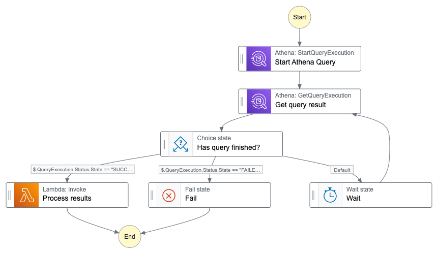

# Amazon Athena result processing

This workflow demonstrates how to ue AWS Step Functions to process results from Amazon Athena Queries written to Amazon S3.

When running SQL queries using Amazon Athena, the query results can be stored in specified locations. One potential location is Amazon S3 to view and download the query result sets for different postprocessing use cases. Amazon Athena automatically stores query results and metadata information for each query that runs in a query result location that you can specify in Amazon S3. If necessary, you can access the files in this location to work with them. You can also download query result files directly from the Amazon Athena console.

Typical use cases where this pattern is helpful, are

- querying [cost and usage reports](https://wellarchitectedlabs.com/cost/300_labs/300_automated_cur_query_and_email_delivery/) and send the results via E-Mail (or other channels) to development or operation teams.
- querying [engagement analytics](https://github.com/aws-samples/communication-developer-services-reference-architectures#federated-segmentation-with-amazon-athena) data, create a pre-signed URL and send this to marketing department members to download the results.
- querying [cloud trail logs](https://docs.aws.amazon.com/athena/latest/ug/cloudtrail-logs.html) and send the results to your security team for forensic or auditing purposes.

All use cases have in common, that post processing steps require to access the query results on a file base. This pattern helps you to

1. execute a query
2. waiting for Amazon Athena until the results are written to Amazon S3
3. forwarding the Amazon S3 url of the result file for post processing.

Learn more about this workflow at Step Functions workflows collection: [https://serverlessland.com/workflows](https://serverlessland.com/workflows)

Important: this application uses various AWS services and there are costs associated with these services after the Free Tier usage - please see the [AWS Pricing page](https://aws.amazon.com/pricing/) for details. You are responsible for any AWS costs incurred. No warranty is implied in this example.

## Requirements

- [Create an AWS account](https://portal.aws.amazon.com/gp/aws/developer/registration/index.html) if you do not already have one and log in. The IAM user that you use must have sufficient permissions to make necessary AWS service calls and manage AWS resources.
- [AWS CLI](https://docs.aws.amazon.com/cli/latest/userguide/install-cliv2.html) installed and configured
- [Git Installed](https://git-scm.com/book/en/v2/Getting-Started-Installing-Git)
- [AWS Serverless Application Model](https://docs.aws.amazon.com/serverless-application-model/latest/developerguide/serverless-sam-cli-install.html) (AWS SAM) installed

## Deployment Instructions

1. Create a new directory, navigate to that directory in a terminal and clone the GitHub repository:
   ```
   git clone https://github.com/aws-samples/step-functions-workflows-collection
   ```
1. Change directory to the pattern directory:
   ```
   cd sfn-athena-results
   ```
1. From the command line, use AWS SAM to deploy the AWS resources for the workflow as specified in the template.yaml file:
   ```
   sam deploy --guided
   ```
1. During the prompts:

   - Enter a stack name
   - Enter the desired AWS Region
   - Allow SAM CLI to create IAM roles with the required permissions.

   Once you have run `sam deploy --guided` mode once and saved arguments to a configuration file (samconfig.toml), you can use `sam deploy` in future to use these defaults.

1. Note the outputs from the SAM deployment process. These contain the resource names and/or ARNs which are used for testing.

## How it works

The workflow starts by starting a query execution on Amazon Athena. In order to execute the query, the following parameters need to be provided in the execution input of your state machine.

```json
{
  "Database": "my-athena-database-name",
  "Table": "my-athena-table-name",
  "Workgroup": "my-athena-workgroup-name"
}
```

Athena executes the query async so in order to reliably proces the query results, we have to wait until the query is in the `FINISHED` state. The workflow uses the `GetQueryExecution` method to get the current state. Depending the current value of the query state, the workflow

a) fails if the query is in the state `FAILED` or `CANCELLED`
b) continues with the prostprocessing if the state is `SUCCEEDED` or
c) waits and fetches the state again as long it is `QUEUED` or `RUNNING`

In case the query state is `SUCCEEDED` the workflow will continue with a state to process the results by providing the output location of the result set as an input. The implementation of the postprocessing is highly dependent on the connected use case. In this sample we simulate the post processing by invoking a Lambda function that logs the incoming event.

## Image



## Testing

The sample does not provide an own Athena table. Feel free to create your own or reuse your existing setup. If you don't have any tables provisioned, you will find some easy to setup examples of [how to query AWS service logs](https://docs.aws.amazon.com/athena/latest/ug/querying-AWS-service-logs.html) of services you already use.

You can start the execution of the Step Function using the following CLI command

```sh
aws stepfunctions start-execution --state-machine-arn STATE_MACHINE_ARN --input "{ \"Database\": \"my-athena-database-name\", \"Table\": \"my-athena-table-name\", \"Workgroup\": \"my-athena-workgroup-name\" }"
```

You will find the `STATE_MACHINE_ARN` in the outputs of the SAM template.

## Cleanup

1. Delete the stack
   ```bash
   aws cloudformation delete-stack --stack-name STACK_NAME
   ```
1. Confirm the stack has been deleted
   ```bash
   aws cloudformation list-stacks --query "StackSummaries[?contains(StackName,'STACK_NAME')].StackStatus"
   ```

---

Copyright 2022 Amazon.com, Inc. or its affiliates. All Rights Reserved.

SPDX-License-Identifier: MIT-0
