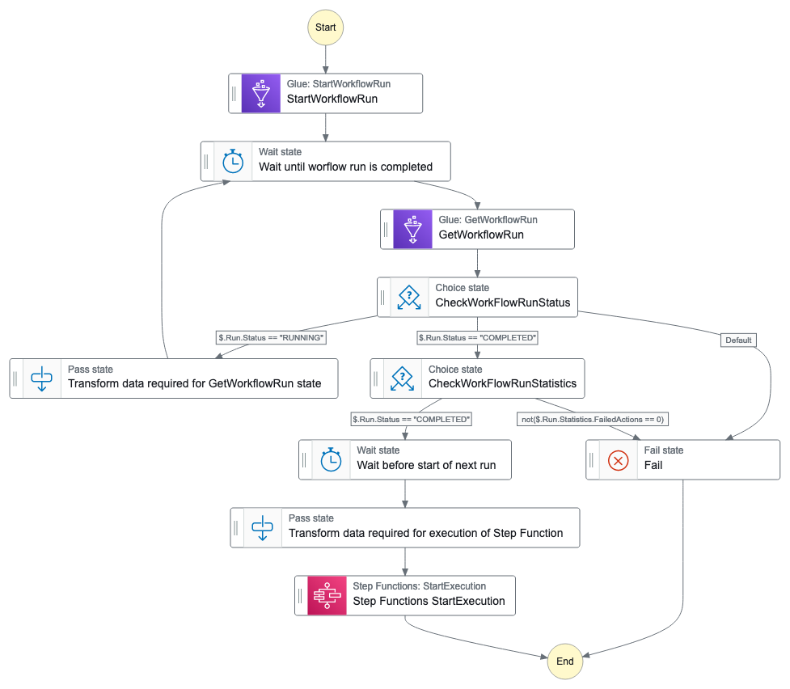

# Orchestrate continuous running Glue Workflow

This workflow demonstrates how to orchestrate a continuous running Glue workflow. In summary, the Step Function continuously triggers Glue workflow, monitors their progress and reacts based on outcome. If workflow completes successfully with no failed actions, it initiates new executions to maintain the continuous workflow orchestration. However, if any failures occur within the workflows, it stops its own execution to prevent further processing.

Important: this application uses various AWS services and there are costs associated with these services after the Free Tier usage - please see the [AWS Pricing page](https://aws.amazon.com/pricing/) for details. You are responsible for any AWS costs incurred. No warranty is implied in this example.

## Requirements

* [Create an AWS account](https://portal.aws.amazon.com/gp/aws/developer/registration/index.html) if you do not already have one and log in. The IAM user that you use must have sufficient permissions to make necessary AWS service calls and manage AWS resources.
* [AWS CLI](https://docs.aws.amazon.com/cli/latest/userguide/install-cliv2.html) installed and configured
* [Git Installed](https://git-scm.com/book/en/v2/Getting-Started-Installing-Git)
* [Terraform](https://learn.hashicorp.com/tutorials/terraform/install-cli?in=terraform/aws-get-started) installed

## Deployment Instructions

1. Create a new directory, navigate to that directory in a terminal and clone the GitHub repository:
    ```
    git clone https://github.com/aws-samples/step-functions-workflows-collection
    ```
1. Change directory to the pattern directory:
    ```
    cd sfn-continous-running-glue-workflow-tf
    ```
1. From the command line, use Terraform to deploy the AWS resources for the workflow as specified in the ```main.tf``` file:
    ```
    terraform init
    terraform apply
    ```

## How it works

The workflow starts by triggering a Glue workflow. In order to trigger the Glue workflow, the following parameters need to be provided in the execution input of your state machine.

```json
{
  "workflow_name": "my-workflow-name"
}
```

Here is the breakdown of the functioning of the workflow:
* **Triggering Glue Workflow**: Initially, the Step Function triggers a Glue workflow to begin its execution.
* **Polling for Completion**: After triggering the Glue workflow, the Step Function enters a polling loop. It periodically checks the status of the Glue workflow, every 60 seconds.
* **Completion Check**: Once the Glue workflow completes, the Step Function checks if there are any failed actions within the workflow.
* **Decision Making:**
    * If there are no failed actions detected, the Step Function initiates a new execution of itself, thereby starting the process all over again. This effectively creates a continuous loop of triggering Glue workflows.
    * If there are failed actions within the Glue workflow, the Step Function stops its execution. This ensures that the process halts when errors or failures occur during the Glue workflow execution.

## Image



## Testing
The sample does not provide an Glue workflow. Feel free to create your own or reuse your existing workflow.

Manually trigger the workflow via the Console or the AWS CLI.

To trigger the workflow in the console, navigate to Step Functions and then click the step function name from the list of State Machines. In the Executions panel, click Start Execution, provide the required input mentioned above and click Start Execution again in the popup.

## Cleanup

1. Delete the stack
    ```bash
    terraform destroy
    ```
1. During the prompts:
    ```bash
    Do you really want to destroy all resources?
    Terraform will destroy all your managed infrastructure, as shown above.
    There is no undo. Only 'yes' will be accepted to confirm.

    Enter a value: Yes
    ```
----
Copyright 2023 Amazon.com, Inc. or its affiliates. All Rights Reserved.

SPDX-License-Identifier: MIT-0
