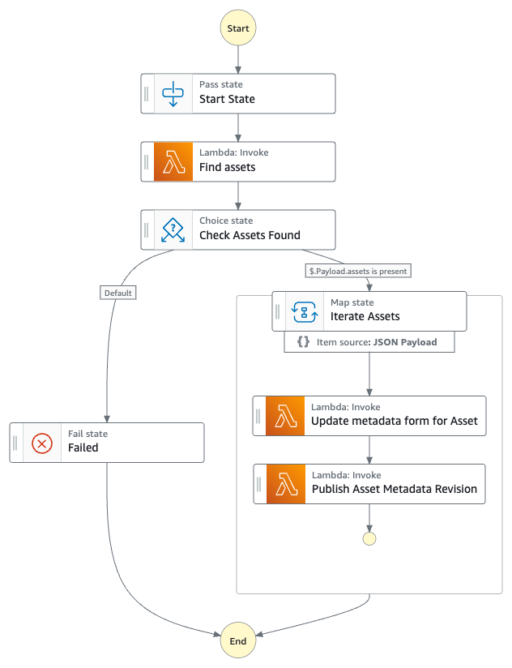

# Update Amazon DataZone metadata form values programmatically

This workflow is an example on how to update Amazon Datazone [Metadata-forms](https://docs.aws.amazon.com/datazone/latest/userguide/create-metadata-form.html) for Amazon DataZone Assets programmatically.

Amazon DataZone metadata forms are simple forms to augment additional business context to the asset metadata in the catalog. The values of metadata forms are usually updated manually by technical or non-technical Data users.

In some cases, it might be useful to update programmatically the metadata forms values, for example in response to events coming from external systems (for Example: after a data quality job run is completed).

The step function lists the assets in DataZone(in a specific Domain/Project), looking for  assets that match an input tableArn (other matching rules can be added/modified modifying the step function).
After finding the Assets, the step function calls the Amazon DataZone APIs to update the values of a metadata form. The updated values and the formId are passed as input in the step function execution.

Here you can find an example of the step function input:
      
      {
        "Payload": {
          "tableArn": "arn:aws:glue:::table/healthcare_data/patients",
          "metadata": {
            "metadataFormId": "dqmetadata",
            "values": { /* custom metadata form values */
              "dqjoblink": "http://glue/:id/:linkId",
              "dqscore": 80
            }
          }
        }
      }


## Requirements

* [Create an AWS account](https://portal.aws.amazon.com/gp/aws/developer/registration/index.html) if you do not already have one and log in. The IAM user that you use must have sufficient permissions to make necessary AWS service calls and manage AWS resources.
* [AWS CLI](https://docs.aws.amazon.com/cli/latest/userguide/install-cliv2.html) installed and configured
* [Git Installed](https://git-scm.com/book/en/v2/Getting-Started-Installing-Git)
* [AWS Serverless Application Model](https://docs.aws.amazon.com/serverless-application-model/latest/developerguide/serverless-sam-cli-install.html) (AWS SAM) installed

## Deployment Instructions

1. Create a new directory, navigate to that directory in a terminal and clone the GitHub repository:
    ``` 
    git clone https://github.com/aws-samples/step-functions-workflows-collection
    ```
2. Change directory to the pattern directory:
    ```
    cd sfn-datazone-update-metadata-cdk/typescript
    ```
3. Install the nodejs dependencies
    ```
    npm install
    ```
3. From the command line, use AWS CDK to deploy the AWS resources for the workflow as specified in the cdk files:
    ```
    npx cdk deploy --parameters dataZoneDomainId=<value> --parameters dataZoneProjectId=<value>
    ```
4. The lambda function in the step functions already have the right permissions set. Additionally, you need to add the newly created Lambda Role to your DataZone project user base.
  

## How it works

The step function executes a number of lambda functions to:
* List the Amazon DataZone Assets, looking for one that match the tableArn property
* Map over Assets
* Update the metadataForm values
* Publish the updated asset revision 


## Image


## Testing

After deployment, you can test the step function following these steps: 
* head to the AWS console
* check that The newly created role has been added to DataZone user base as mentioned before
* run the step function
* if successful, verify in DataZone that the metadata values are updated


## Cleanup
 
1. Delete the stack
    ```bash
    cdk destroy
    ```
----
Copyright 2023 Amazon.com, Inc. or its affiliates. All Rights Reserved.

SPDX-License-Identifier: MIT-0