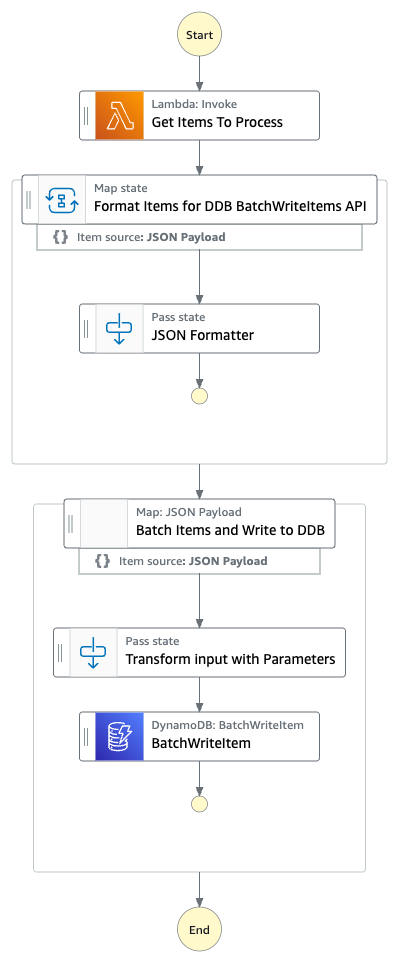

# Step Function to Batch-Write data to DynamoDB

This sample project demonstrates how to use Step Functions to transform and batch data and then write the data batch to DynamoDB Table

Important: this application uses various AWS services and there are costs associated with these services after the Free Tier usage - please see the [AWS Pricing page](https://aws.amazon.com/pricing/) for details. You are responsible for any AWS costs incurred. No warranty is implied in this example.

## Requirements

* [Create an AWS account](https://portal.aws.amazon.com/gp/aws/developer/registration/index.html) if you do not already have one and log in. The IAM user that you use must have sufficient permissions to make necessary AWS service calls and manage AWS resources.
* [AWS CLI](https://docs.aws.amazon.com/cli/latest/userguide/install-cliv2.html) installed and configured
* [Git Installed](https://git-scm.com/book/en/v2/Getting-Started-Installing-Git)
* [AWS Serverless Application Model](https://docs.aws.amazon.com/serverless-application-model/latest/developerguide/serverless-sam-cli-install.html) (AWS SAM) installed

## Deployment Instructions

1. Create a new directory, navigate to that directory in a terminal and clone the GitHub repository:
    ```
    git clone https://github.com/aws-samples/step-functions-workflows-collection
    ```
1. Change directory to the pattern directory:
    ```
    cd sfn-dynamodb-batchwriteitem
    ```
1. From the command line, use AWS SAM to deploy the AWS resources for the workflow as specified in the template.yaml file:
    ```
    sam deploy --guided
    ```
1. During the prompts:
    * Enter a stack name
    * Enter the desired AWS Region
    * Allow SAM CLI to create IAM roles with the required permissions.
    * Accept all other defaults

    Once you have run `sam deploy --guided` mode once and saved arguments to a configuration file (samconfig.toml), you can use `sam deploy` in future to use these defaults.

1. Note the outputs from the SAM deployment process. These contain the resource names and/or ARNs which are used for testing.

## How it works

Step Functions uses a state machine to invoke a Lambda function to get the data to be written to DynamoDB Table. The Lambda function generates an array of JSON containing random sample data.
The first Map state converts the JSON array to BatchWriteItem compatible DynamoDB JSON Array. This data is the passed to Distributed Map State which performs batching of 25 items on data due to validation on BatchWriteItem API of DynamoDB.

## Image



## Testing

Manually trigger the workflow via the Console or the AWS CLI.  The state machine ARN can be found as the ```StepFunctionArn``` in output of ```sam deploy --guided```.

To trigger the workflow in the console, navigate to Step Functions and then click the step function name from the list of State Machines. In the Executions panel, click Start Execution. Click Start Execution again in the popup. Use default input, no additional input is required.

Once the step function completes, check the data in DynamoDB Table. The name of table can be found as the ```DynamoDBTableName``` in output of ```sam deploy --guided```.  The data in DynamoDB table would look like:

<style>
table, th, td {
   border: 1px solid black;
}
</style>

| id  | name | rating |
| :-------: |:---------------:| :-----:|
| 704ddfff-eb86-423b-9381-66b89277301f | Clever Lion | Fair |


## Cleanup

1. Delete the stack
    ```bash
    sam delete
    ```
1. During the prompts:
    ```bash
        Are you sure you want to delete the stack batch-sample in the region us-east-1 ? [y/N]: y
        Are you sure you want to delete the folder batch-sample in S3 which contains the artifacts? [y/N]: y
    ```
----
Copyright 2022 Amazon.com, Inc. or its affiliates. All Rights Reserved.

SPDX-License-Identifier: MIT-0
