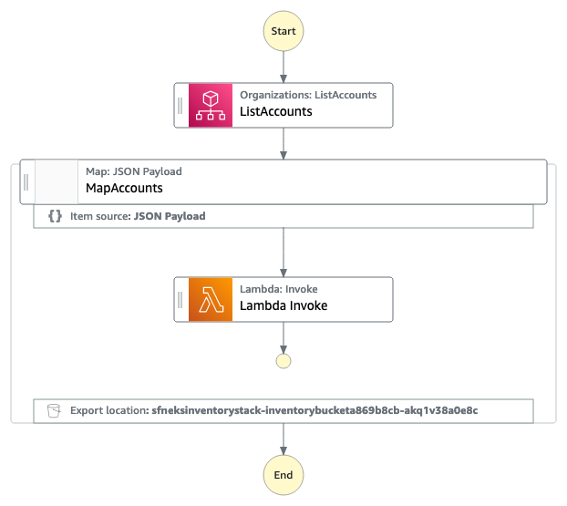

# sfnEksInventory

This workflow demonstrates the Distributed Map to inventorize EKS clusters across an AWS Organization. It gathers ARN's and Version Numbers to build up the inventory.

## Requirements

* [Create an AWS account](https://portal.aws.amazon.com/gp/aws/developer/registration/index.html) if you do not already have one and log in. The IAM user that you use must have sufficient permissions to make necessary AWS service calls and manage AWS resources.
* [AWS CLI](https://docs.aws.amazon.com/cli/latest/userguide/install-cliv2.html) installed and configured
* [Git Installed](https://git-scm.com/book/en/v2/Getting-Started-Installing-Git)
* [AWS Serverless Application Model](https://docs.aws.amazon.com/serverless-application-model/latest/developerguide/serverless-sam-cli-install.html) (AWS SAM) installed

## Deployment Instructions

1. Create a new directory, navigate to that directory in a terminal and clone the GitHub repository:
    ``` 
    git clone https://github.com/aws-samples/step-functions-workflows-collection
    ```
2. Change directory to the pattern directory:
    ```
    cd sfn-eks-inventory
    ```
3. From the command line, use AWS CDK to deploy the AWS resources for the workflow:
    ```
    npx cdk deploy
    ```

## How it works

The example requires pre-existing Cross Account roles in Linked Accounts to allow querying which are out of scope for this example. The roles require ec2:DescribeRegions, eks:ListClusters and eks:DescribeCluster permissions. This role is hard configured to "arn:aws:iam::{account_id}:role/OrgInventoryReader" which can be modified in the python function.

The step function can be initiated by any input or  schedule. Once started it will execute organizations:ListAccounts to create an inventory of accounts. 

Distributed Map then processes account by invoking a Python Lambda Function that lists all enabled ec2 regions, lists clusters in each region and then retrieves its name, arn, platform version and version.

Once the inventory is collected it is written out to s3 with the distributed map ResultWriter.

The workflow has loose concurrency control, it is pre-configured with MaxConcurrency 10.

This integration pattern can be reused with other services and tasks with Step Functions.

 
## Image
Provide an exported .png of the workflow in the `/resources` directory from [Workflow stuio](https://docs.aws.amazon.com/step-functions/latest/dg/workflow-studio.html) and add here.




Notes: 
1. When implementing this workflow in production take care that you change the CDK S3 removalPolicy to your desired settings by removing the below blocks.

```
removalPolicy: cdk.RemovalPolicy.DESTROY,
autoDeleteObjects: true,
```
2. The 'Wait for Textract Callback Token' state implements a 1800 second timeout for processing of Documents

## Cleanup

From the pattern directory, run
 
1. Delete the stack
    ```bash
    npx cdk destroy
    ```

----
Copyright 2022 Amazon.com, Inc. or its affiliates. All Rights Reserved.

SPDX-License-Identifier: MIT-0
