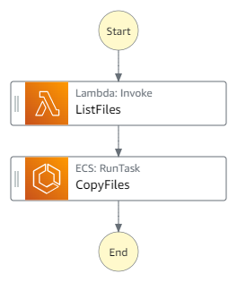

This is a sample project that showcases how to use AWS Cloud Development Kit (CDK) to deploy a serverless workflow using AWS Step Functions inetegrated with ECS Fargate task.

## Prerequisites
Before starting, make sure you have the following installed on your local development machine:

* [.NET Core](https://dotnet.microsoft.com/en-us/download/dotnet/6.0) installed
* [Create an AWS account](https://portal.aws.amazon.com/gp/aws/developer/registration/index.html) if you do not already have one and log in. The IAM user that you use must have sufficient permissions to make necessary AWS service calls and manage AWS resources.
* [AWS CLI](https://docs.aws.amazon.com/cli/latest/userguide/install-cliv2.html) installed and configured
* [Git Installed](https://git-scm.com/book/en/v2/Getting-Started-Installing-Git)
* [AWS CDK](https://docs.aws.amazon.com/cdk/v2/guide/work-with-cdk-csharp.html) installed

## Getting Started
To get started, follow these steps:

1. Clone this repository to your local machine.
2. Open a terminal window and navigate to the root directory of the project.
3. In Program.cs file under cdk project, either pass you AWS account id or set enviorment variable `CDK_DEFAULT_ACCOUNT` with aws account id.
   `
                Env = new Amazon.CDK.Environment
                {
                    Account = System.Environment.GetEnvironmentVariable("CDK_DEFAULT_ACCOUNT"),
                    Region = System.Environment.GetEnvironmentVariable("CDK_DEFAULT_REGION"),
                }
   `
4. Run `dotnet restore` to restore the NuGet packages.
5. Run `dotnet publish -c Release`
5. Run `cdk bootstrap` to create an S3 bucket in your AWS account to store the CDK toolkit stack.
5. Run `cdk deploy` to deploy the application stack to your AWS account.
6. After the deployment is complete, you should see a Step Function state machine and an ECS Fargate task definition in your AWS account.

## Project Structure
The project structure is as follows:

1. **cdk** - CDK project to setup AWS services
2. **CleanupTask** - Sample application configured in docker  image
4. **CopyFilesTask** - Sample application configured in docker image
5. **ListFilesFunction** - A lambda function
6. **WorkflowApp.Models** - A class library for project model classes
7. **Dockerfile** - containing all the commands requires to call on the command line to assemble an image

## Image
Provide an exported .png of the workflow in the `/resources` directory from [Workflow studio](https://docs.aws.amazon.com/step-functions/latest/dg/workflow-studio.html) and add here.

## Resources Created
The following AWS resources are created by the CDK stacks:

1. **ECS Fargate Task Definition** - An ECS task definition that references a Docker image from a ECR registry.
2. **AWS Lambda function** - A sample AWS Lambda function added to the state machine.
2. **Step Function State Machine** - A Step Function state machine that orchestrates the execution of the ECS Fargate task using AWS Step Functions.
3. **IAM Roles and Policies**
    - An IAM role for the ECS task execution.
    - An IAM role for the Step Function execution.

## Testing and Validation
1. Log in to your AWS Management Console and navigate to the AWS Step Functions service.
2. Click on the State machines tab and select the state machine name strat with `WorkflowAppStateMachine`.
3. Click on the Start Execution button to start the execution of the state machine.
4. In the Start Execution dialog box, enter below input data, and click the Start Execution button.
   `
   {
  "SourceLocation": "MyFiles/A",
  "TargetLocation": "MyFiles/B"
   }
   `
5. The execution details page will open where you can monitor the execution of your state machine.
6. Once the execution is complete, you can check the output in the Execution Details section.
7. To validate the state machine, you can check if the execution went through all the states as defined in the state machine definition.
8. To validate `ListFilesFunction` execution logs, click on Logs on against `ListFiles` step, and to check ECS Task logs, click on `ECSTask` and then check logs. 
9. You can also use the CloudWatch Logs console to view the logs generated during the execution of your state machine.

## Cleaning up
To delete the resources created by this project, run `cdk destroy`.

## Conclusion
This project demonstrates how to use AWS CDK to deploy a serverless workflow using AWS Step Functions and an ECS Fargate task. With the AWS CDK, you can define your infrastructure as code, which makes it easier to manage and automate the deployment of your applications.