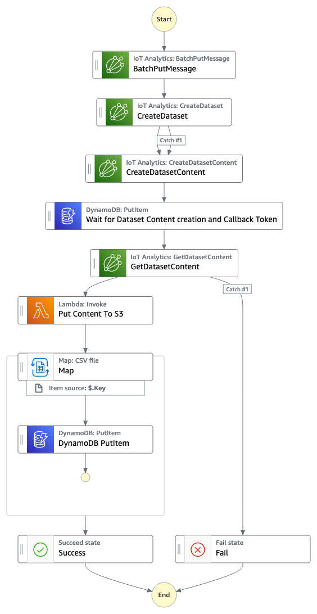

# sfn-iot-data-analytics-dataset

This workflow uses the Callback pattern and Distributed Map to create a IoT Analytics Pipeline.

Important: this application uses various AWS services and there are costs associated with these services after the Free Tier usage - please see the [AWS Pricing page](https://aws.amazon.com/pricing/) for details. You are responsible for any AWS costs incurred. No warranty is implied in this example.

## Requirements

* [Create an AWS account](https://portal.aws.amazon.com/gp/aws/developer/registration/index.html) if you do not already have one and log in. The IAM user that you use must have sufficient permissions to make necessary AWS service calls and manage AWS resources.
* [AWS CLI](https://docs.aws.amazon.com/cli/latest/userguide/install-cliv2.html) installed and configured
* [Git Installed](https://git-scm.com/book/en/v2/Getting-Started-Installing-Git)
* [AWS Serverless Application Model](https://docs.aws.amazon.com/serverless-application-model/latest/developerguide/serverless-sam-cli-install.html) (AWS SAM) installed

## Deployment Instructions

1. Create a new directory, navigate to that directory in a terminal and clone the GitHub repository:
    ``` 
    git clone https://github.com/aws-samples/step-functions-workflows-collection
    ```
2. Change directory to the pattern directory:
    ```
    cd sfn-iot-data-analytics-dataset
    ```
3. From the command line, use AWS CDK to deploy the AWS resources for the workflow:
    ```
    npx cdk deploy
    ```

## How it works

The Step Function creates a sample dataset of Wind Turbine power readings and distrubtes them into a pre-existing pipeline configured with CDK. The Step Function then creates a dataset that summarizes average power readings per wind turbine. This summary is then written out to DynamoDB. 

During large scale ingestion of data Batching needs be configured on the distributed Map as well as managing concurrency to adhere to account quotas.

This integration pattern can be reused with other services and tasks with Step Functions.

 
## Image
Provide an exported .png of the workflow in the `/resources` directory from [Workflow stuio](https://docs.aws.amazon.com/step-functions/latest/dg/workflow-studio.html) and add here.



## Testing

To test the workflow execute the workflow with events from [power_events.json](./power_events.json)

1. Uploading an S3 Object with text onto the Source Bucket deployed by the CDK deployment
2. Start the workflow with a test event as in the example by below. You must replace the BUCKET_NAME with the source bucket deployed through CDK.


Notes: 
1. When implementing this workflow in production take care that you change the CDK S3 removalPolicy to your desired settings by removing the below blocks.

```
removalPolicy: cdk.RemovalPolicy.DESTROY,
autoDeleteObjects: true,
```
2. The 'Wait for Dataset Content creation and Callback Token' state implements a 1800 second timeout for processing of Documents

## Cleanup

From the pattern directory, run
 
1. Delete the stack
    ```bash
    npx cdk destroy
    ```
## Architecture

Some components from the workflow are not rendered through Workflow Studio as they are not Workflow components. They are still required for the solution and the schematic is as follows. 

1. Execute the workflow with input from [power_events.json](./power_events.json)
2. The workflow pushes events through to an IoT Analytics pipeline
3. Step Functions creates an IoT Analytics dataset
4. Content generation is executed by the workflow
5. When the dataset contents are created a callback token resumes the operation
6. The summaraised dataset is uploaded to DynamoDB 


----
Copyright 2022 Amazon.com, Inc. or its affiliates. All Rights Reserved.

SPDX-License-Identifier: MIT-0


# Welcome to your CDK TypeScript project

This is a blank project for CDK development with TypeScript.

The `cdk.json` file tells the CDK Toolkit how to execute your app.

## Useful commands

* `npm run build`   compile typescript to js
* `npm run watch`   watch for changes and compile
* `npm run test`    perform the jest unit tests
* `cdk deploy`      deploy this stack to your default AWS account/region
* `cdk diff`        compare deployed stack with current state
* `cdk synth`       emits the synthesized CloudFormation template


## Sample IoT Event

Healthy Event

```json
{
  "timestamp": "20230707T09:30:00Z",
  "device_id": "siemens_wind_turbine_456",
  "message_type": "status_update",
  "component": "N/A",
  "status": "healthy",
  "severity": "normal",
  "type": "meter",
  "power_output": 2150.75,
  "wind_speed": 12.5,
  "location": {
    "latitude": 52.5200,
    "longitude": 13.4050
  }
}
```

Unhealthy Event

```json
{
  "timestamp": "20230707T09:15:00Z",
  "device_id": "siemens_wind_turbine_123",
  "message_type": "component_failure",
  "component": "gearbox",
  "status": "unhealthy",
  "severity": "critical",
  "type": "health",
  "message": "Attention: The gearbox of the wind turbine is showing signs of imminent failure. Immediate maintenance is required.",
  "location": {
    "latitude": 51.5074,
    "longitude": -0.1278
  }
}
```

AWS CLI
```
aws iotanalytics batch-put-message  --channel-name turbinechannel  --messages file://power_events_stringified.json --cli-binary-format raw-in-base64-out
```