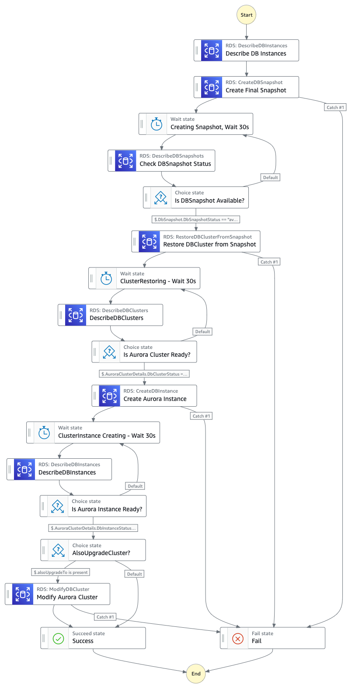

# AWS Step Functions Standard Workflow to migrate RDS PostgreSQL DB instance to Aurora PostgreSQL Cluster

This workflow demonstrates how to use AWS Step Functions to migrate an RDS PostgreSQL DB instance to Aurora PostgreSQL DB Cluster. This pattern leverages the native AWS SDK integrations in the AWS Step Functions standard workflow to interact with Amazon RDS which means only JSON-based, structured language is used to define the implementation.

The CDK application deploys a Step Functions workflow that takes in a user input which specifies the RDS DB instance Id, and the targeted DB instance class to use for the Aurora DB Cluster. User input can also include an optional & compatible Aurora PostgreSQL version to upgrade the cluster to during this migration. This Step Function workflow should be executed from the account and region where the RDS instance exists and will create the Aurora Cluster in the same account and region. The CDK application contains the minimum IAM resources required to run the application.

There are multiple ways to [Migrate RDS DB instance to Aurora with PostgreSQL compatiblity](https://docs.aws.amazon.com/AmazonRDS/latest/AuroraUserGuide/AuroraPostgreSQL.Migrating.html). This workflow follows the approach of Migrating an RDS for PostgreSQL DB instance using a snapshot. 

> NOTE: This workflow only works for **PostgreSQL DB Engine**. Please verify the [Supported DB instance class](https://docs.aws.amazon.com/AmazonRDS/latest/UserGuide/Concepts.DBInstanceClass.html#Concepts.DBInstanceClass.Support) and Aurora PostgreSQL Cluster Engine Version you are upgrading to are compatible with the RDS instance engine version. Please see AWS documentation on [Upgrading the PostgreSQL DB engine for Amazon RDS](https://docs.aws.amazon.com/AmazonRDS/latest/UserGuide/USER_UpgradeDBInstance.PostgreSQL.html)

Learn more about this workflow at Step Functions workflows collection: [https://github.com/aws-samples/step-functions-workflows-collection/tree/main/sfn-rds-to-aurora-migrate-postgres-cdk](https://github.com/aws-samples/step-functions-workflows-collection/tree/main/sfn-rds-to-aurora-migrate-postgres-cdk)

Important: this application uses various AWS services and there are costs associated with these services after the Free Tier usage - please see the [AWS Pricing page](https://aws.amazon.com/pricing/) for details. You are responsible for any AWS costs incurred. No warranty is implied in this example.

## Requirements

* [Create an AWS account](https://portal.aws.amazon.com/gp/aws/developer/registration/index.html) if you do not already have one and log in. The IAM user that you use must have sufficient permissions to make necessary AWS service calls and manage AWS resources.
* [AWS CLI](https://docs.aws.amazon.com/cli/latest/userguide/install-cliv2.html) installed and configured
* [Git Installed](https://git-scm.com/book/en/v2/Getting-Started-Installing-Git)
* [AWS Cloud Development Kit CLI (v2)](https://docs.aws.amazon.com/cdk/v2/guide/getting_started.html) (AWS CDK v2) installed

## Deployment Instructions

1. Create a new directory, navigate to that directory in a terminal and clone the GitHub repository:
    ``` 
    git clone https://github.com/aws-samples/step-functions-workflows-collection
    ```
1. Change directory to the pattern directory:
    ```
    cd step-functions-workflows-collection/sfn-rds-to-aurora-migrate-postgres-cdk
    ```
1. Create a virtual environment for python:
    ```bash
    python3 -m venv .venv
    ```
1. Activate the virtual environment:
    ```bash
    source .venv/bin/activate
    ```

    If you are in Windows platform, you would activate the virtualenv like this:

    ```
    % .venv\Scripts\activate.bat
    ```

1. Install python modules:
    ```bash
    python3 -m pip install -r requirements.txt
    ```
1. From the command line, use CDK to synthesize the CloudFormation template and check for errors:

    ```bash
    cdk synth
    ```
    
    NOTE: You may need to perform a one time cdk bootstrapping using the following command. See [CDK Bootstrapping](https://docs.aws.amazon.com/cdk/v2/guide/bootstrapping.html) for more details.
    ```bash
    cdk bootstrap aws://<ACCOUNT-NUMBER-1>/<REGION-1>
    ```
1. From the command line, use CDK to deploy the stack:

    ```bash
    cdk deploy
    ```

Expected result:
```bash
(.venv) bash-3.2$ cdk deploy

  ✅  SfnMigrateRdsToAuroraPostgresWorkflowCdkStack

Outputs:
SfnMigrateRdsToAuroraPostgresWorkflowCdkStack.SFArn = arn:aws:states:us-east-1:XXXXXXXXX:stateMachine:rds-migrate-to-aurora-postgres-workflow
SfnMigrateRdsToAuroraPostgresWorkflowCdkStack.SFName = rds-migrate-to-aurora-postgres-workflow
Stack ARN:
arn:aws:cloudformation:us-east-1:XXXXXXXXX:stack/SfnMigrateRdsToAuroraPostgresWorkflowCdkStack/ae836910-0000-0000-0000-0e11b1860d21
```

1. Note the outputs from the CDK deployment process. These contain the resource names and/or ARNs which are used for testing.

## How it works
Once the CDK stack is deployed successfully, a Step Function workflow is created in the account & region provided during the bootstrap step. Go to AWS Step Function Console to understand the basic state machine created. 

This State Machine workflow converts an RDS PostgreSQL (R-PgSQL) DB instance to an Aurora PostgreSQL (A-PgSQL) DB Cluster by migrating the data from one to another. 
The workflow is divided into the following states: 
1. create a snapshot of the R-PgSQL instance 
2. restore an A-PgSQL Cluster using this snapshot 
3. create an instance of A-PgSQL inside the cluster
4. (optionally) upgrade the A-PgSQL cluster engine version

The final RDS snapshot will be named `{rds-instance-name}-final-snapshot`. 
The A-PgSQL Cluster will be named `{rds-instance-name}-apg-cluster`. 
The Primary node in the A-PgSQL cluster will be named `{rds-instance-name}-apg-instance-1`. 

The Step Function workflow requires the following input parameters when triggering the execution: 
```bash
{
    "dbInstanceId": "<The Name of R-PgSQL instance to convert to A-PgSQL cluster>",
    "dbInstanceClass": "<The compatible compute and memory capacity of the A-PgSQL DB instance that will be created, for example db.m5.large>",
    "alsoUpgradeTo": "<Optional - if supplied, the compatible (major) version to try to upgrade A-PgSQL instance to after migrating>"
}
```

When the CDK is deployed, it will create an IAM role for the Step Function with the following required permissions: 
```bash
"rds:AddTagsToResource",
"rds:createDBInstance",
"rds:createDBSnapshot",
"rds:describeDBClusters",
"rds:describeDBInstances",
"rds:describeDBSnapshots",
"rds:modifyDBCluster",
"rds:restoreDBClusterFromSnapshot"
 ```

> NOTE: This workflow will only migrate RDS instance in the account and region where this CDK is deployed and the Step Function state machine is created. It does not support cross account or cross region migrations currently.


## Image




## Testing

Go to the AWS Step Functions Console and select the Step Function created by CDK (look for a name starting with `SfnMigrateRdsToAuroraPost`). Execute the step function workflow and provide the input parameters as described above. 
```bash
{
    "dbInstanceId": "<name of R-PgSQL instance to convert to A-PgSQL cluster>",
    "dbInstanceClass": "<The compute and memory capacity of the A-PgSQL DB instance that will be created, for example db.m5.large>",
    "alsoUpgradeTo": "<Optional - if supplied, the version to try to upgrade A-PgSQL instance to after migrating>"
}
```

Wait for the Step Function workflow to complete. You can check the progress of the execution steps under the Executions section. 

> NOTE: Depending on your source RDS instance size & data, the migration can take from a few minutes to several hours. The state machine will periodcally check the status of various steps and mve to the next step accordingly. The State Machine standadrd workflow can run for up to 365 days, after which it times out. 

The following images show the expected results:

#### Migrate & Upgrade RDS DB instance to Aurora Cluster Workflow


## Cleanup
1. Delete the stack
    ```bash
    cdk destroy
    ```

## Tutorial

See [this useful workshop](https://cdkworkshop.com/30-python.html) on working with the AWS CDK for Python projects.

## Useful commands

 * `cdk ls`          list all stacks in the app
 * `cdk synth`       emits the synthesized CloudFormation template
 * `cdk deploy`      deploy this stack to your default AWS account/region
 * `cdk diff`        compare deployed stack with current state
 * `cdk docs`        open CDK documentation


Enjoy!
----
Copyright 2022 Amazon.com, Inc. or its affiliates. All Rights Reserved.

SPDX-License-Identifier: MIT-0
