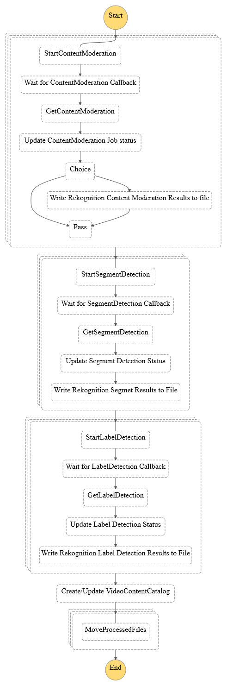

# AWS Step Functions Video Processing with Amazon Rekognition and Distributed Map State

This workflow application leverages Distributed Map State to bulk process videos using Amazon Rekognition Video. 
The use of Distributed Map allows the application to configure s3 as data source, configure cconcurrency to manage and avoid
hitting Rekognition Video thresholds, and continue processing. 

The applications intent is to extract data from within videos such as: people, objects, emotions, segments, inappropriate content and more.
The data extracted is then used to populate a video content data catalog which can be used to:
* automatically generate related videos for playlist curation
* identify areas for ad insertion and what relevant ads to present based on the content

## Requirements

* [Create an AWS account](https://portal.aws.amazon.com/gp/aws/developer/registration/index.html) if you do not already have one and log in. The IAM user that you use must have sufficient permissions to make necessary AWS service calls and manage AWS resources.
* [AWS CLI](https://docs.aws.amazon.com/cli/latest/userguide/install-cliv2.html) installed and configured
* [Git Installed](https://git-scm.com/book/en/v2/Getting-Started-Installing-Git)
* [AWS Cloud Development Kit](https://docs.aws.amazon.com/cdk/v2/guide/getting_started.html) installed

## Deployment Instructions

1. Create a new directory, navigate to that directory in a terminal and clone the GitHub repository:
    ``` 
    git clone https://github.com/aws-samples/step-functions-workflows-collection
    ```
2. Change directory to the pattern directory:
    ```
    cd sfn-rekognition-video-catalog-workflow
    ```
3. Bootstrap your environment:
    Bootstrapping is the process of provisioning resources for the AWS CDK before you can deploy AWS CDK apps into an AWS environment.(https://docs.aws.amazon.com/cdk/v2/guide/bootstrapping.html)
    ```
    cdk bootstrap aws://ACCOUNT-NUMBER/REGION
    ```
4. From the command line, use AWS CDK to synthensize and deploy the AWS resources for the workflow as specified in the cdk.json file:
    ```
    cdk synth
    cdk deploy
    ```
## How it works
This workflow application is a state machine that leverages Distributed Map State for bulk analysis processing of videos with the use of Amazon Rekognition Video.
Distributed Map mode allows you to specify an s3 bucket as a source and in this example, act as a queue for Amazon Rekogintion Video analysis. 
Amazon Rekognition Video supports a maximum of 20 concurrent jobs per account, the distributed map mode allows you to configure concurrency so that you can avoid hitting Amazon Rekogintion Video thresholds, and continue processing.
DynamoDB is configured to keep record of rekognition jobs and can be used to enhance the workflow application for retry processing. 
Amazon Rekogintion Video results are written out to an s3 bucket as csv files through lambda functions. The output files are then consumed by a Glue crawler to populate a video content data catalog.
## Image


## Testing
Sample videos (short clips) are included as part of the cdk and are deployed to the s3 bucket videos-for-processing-[account number]-[region].


## Cleanup
Execute the following CDK command to delete the stack
```
cdk destroy SfnRekognitionVideoCatalogWorkflowStack
```