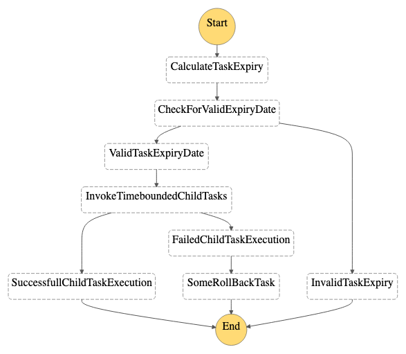

# Step Function Task Timer

This workflow demonstrates an implementation of a task timer where a user wants to execute an user dependent workflow like KYC update within a timestamp. This utilises two statemachines, lambda function and SNS for user notifications.

Important: this application uses various AWS services and there are costs associated with these services after the Free Tier usage - please see the [AWS Pricing page](https://aws.amazon.com/pricing/) for details. You are responsible for any AWS costs incurred. No warranty is implied in this example.

## Requirements

* [Create an AWS account](https://portal.aws.amazon.com/gp/aws/developer/registration/index.html) if you do not already have one and log in. The IAM user that you use must have sufficient permissions to make necessary AWS service calls and manage AWS resources.
* [AWS CLI](https://docs.aws.amazon.com/cli/latest/userguide/install-cliv2.html) installed and configured
* [Git Installed](https://git-scm.com/book/en/v2/Getting-Started-Installing-Git)
* [AWS Serverless Application Model](https://docs.aws.amazon.com/serverless-application-model/latest/developerguide/serverless-sam-cli-install.html) (AWS SAM) installed

## Deployment Instructions

1. Create a new directory, navigate to that directory in a terminal and clone the GitHub repository:
    ``` 
    git clone https://github.com/aws-samples/step-functions-workflows-collection
    ```
1. Change directory to the pattern directory:
    ```
    cd sfn-sns-task-timer
    ```
1. From the command line, use AWS SAM to deploy the AWS resources for the workflow as specified in the template.yaml file:
    ```
    sam deploy --guided
    ```
1. During the prompts:
    * Enter a stack name
    * Enter the desired AWS Region
    * Allow SAM CLI to create IAM roles with the required permissions.

    Once you have run `sam deploy --guided` mode once and saved arguments to a configuration file (samconfig.toml), you can use `sam deploy` in future to use these defaults.

1. Note the outputs from the SAM deployment process. These contain the resource names and/or ARNs which are used for testing:

    * ```TopicName```: Name of the SNS topic where result is sent.
    * ```StateMachineName```: Name of Step Functions State Machine orchestrating the process.
    * ```StateMachineArn```:  ARN of the Step Functions State Machine orchestrating the process.

## How it works

This workflow simulates a task timer with an expiry date. The first state machine task - CalculateTaskExpiry uses a Lambda function to calculate the time difference between the current date and the input timestamp (expirydate). The task - CheckForValidExpiryDate checks the validity of the input date and drives the flow to the next state - InvokeTimeboundedChildTasks task which has its timeout configured as the time difference calculated above. This task executes a child state machine to execute the user dependent activities like KYC, online registration and fee submission. Depending upon whether the time difference is valid or the child state machine execution is successful or not, an SNS notification is sent out to the admin of the flow.

## Image



## Testing

The solution creates a subscription for the admin of the flow. However, after deployment, you may add an email subscription to the SNS Topic as well found in the stack Output. Manually trigger the Task Timer state machine either from the Console or using the CLI, using the following payload with date in UTC -

```
{
  "expirydate": "2023-06-09T04:13:00Z"
}
```

## Cleanup
 
1. Delete the stack
    ```bash
    sam delete
    ```

----
Copyright 2022 Amazon.com, Inc. or its affiliates. All Rights Reserved.

SPDX-License-Identifier: MIT-0
