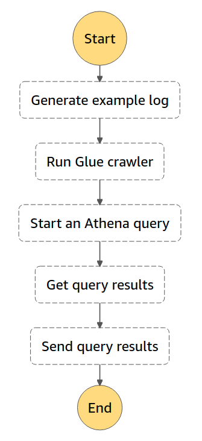

# Start an Athena query

This workflow use Step Functions and Amazon Athena to start an Athena query and send a notification with query results. This sample project creates the following:

* An Amazon Athena query
* An AWS Glue crawler
* An Amazon Simple Notification Service topic
* Related AWS Identity and Access Management (IAM) roles


Learn more about this workflow at Step Functions workflows collection: https://docs.aws.amazon.com/step-functions/latest/dg/sample-athena-query.html

Important: this application uses various AWS services and there are costs associated with these services after the Free Tier usage - please see the [AWS Pricing page](https://aws.amazon.com/pricing/) for details. You are responsible for any AWS costs incurred. No warranty is implied in this example.

## Requirements

* [Create an AWS account](https://portal.aws.amazon.com/gp/aws/developer/registration/index.html) if you do not already have one and log in. The IAM user that you use must have sufficient permissions to make necessary AWS service calls and manage AWS resources.
* [AWS CLI](https://docs.aws.amazon.com/cli/latest/userguide/install-cliv2.html) installed and configured
* [Git Installed](https://git-scm.com/book/en/v2/Getting-Started-Installing-Git)
* [AWS Serverless Application Model](https://docs.aws.amazon.com/serverless-application-model/latest/developerguide/serverless-sam-cli-install.html) (AWS SAM) installed

## Deployment Instructions

1. Create a new directory, navigate to that directory in a terminal and clone the GitHub repository:
    ``` 
    git clone https://github.com/aws-samples/step-functions-workflows-collection
    ```
1. Change directory to the pattern directory:
    ```
    cd start_athena_query
    ```
1. From the command line, use Terraform to deploy the AWS resources for the workflow as specified in the ```main.tf``` file:
    ```
    terraform init
    terraform apply
    ```
1. Note the outputs from the Terraform deployment process. These contain the resource names and ARNs which are used for testing.

## How it works

The workflow starts by initializing a state machine, and the first task in the sequence is to trigger a lambda function, which generates data.

Next, another lambda function is triggered, which invokes a Glue crawler, which is a service that automatically discovers and categorizes data stored in S3. The Athena query is then initiated and runs until it is completed.

Once the query is completed, the results are obtained and published to the SNS (Simple Notification Service) topic. SNS is a web service that allows users to send notifications from the cloud to various subscribers or endpoints, such as email, SMS, or mobile push notifications.

## Image



## Testing


Manually trigger the workflow via the Console or the AWS CLI.  The state machine ARN can be found as the ```state_machine_arn``` output and the state machine name can be found as ```state_machine_name``` in the output.

To trigger the workflow in the console, navigate to Step Functions and then click the step function name from the list of State Machines.  In the Executions panel, click Start Execution.  Click Start Execution again in the popup.  No additional input is required.

## Cleanup
 
1. Delete the stack
    ```bash
    terraform destroy
    ```
1. During the prompts:
    ```bash
    Do you really want to destroy all resources?
    Terraform will destroy all your managed infrastructure, as shown above.
    There is no undo. Only 'yes' will be accepted to confirm.

    Enter a value: Yes
    ```
----
Copyright 2022 Amazon.com, Inc. or its affiliates. All Rights Reserved.

SPDX-License-Identifier: MIT-0
