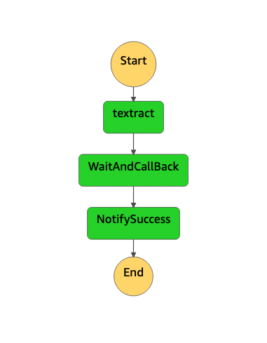

# Workflow title

This workflow shows how the Callback pattern can be applied to the asynchronous Textract StartDocumentTextDetection API call.

Important: this application uses various AWS services and there are costs associated with these services after the Free Tier usage - please see the [AWS Pricing page](https://aws.amazon.com/pricing/) for details. You are responsible for any AWS costs incurred. No warranty is implied in this example.

## Requirements

* [Create an AWS account](https://portal.aws.amazon.com/gp/aws/developer/registration/index.html) if you do not already have one and log in. The IAM user that you use must have sufficient permissions to make necessary AWS service calls and manage AWS resources.
* [AWS CLI](https://docs.aws.amazon.com/cli/latest/userguide/install-cliv2.html) installed and configured
* [Git Installed](https://git-scm.com/book/en/v2/Getting-Started-Installing-Git)
* [AWS Serverless Application Model](https://docs.aws.amazon.com/serverless-application-model/latest/developerguide/serverless-sam-cli-install.html) (AWS SAM) installed

## Deployment Instructions

1. Create a new directory, navigate to that directory in a terminal and clone the GitHub repository:
    ``` 
    git clone https://github.com/aws-samples/step-functions-workflows-collection
    ```
2. Change directory to the pattern directory:
    ```
    cd sfn-textract-callback-ts-cdk
    ```
3. From the command line, use AWS CDK to deploy the AWS resources for the workflow:
    ```
    npx cdk deploy
    ```

## How it works

The example demonstrates the integration of the StartDocumentDetection Textract API into Step Functions. The Workflow input is an  S3 bucket and object key. It will begin by processing the object with Textract and then use the Callback method by inserting a Token onto SQS with a GroupID.

While waiting for a Callback, the pre-configured SNS notification on the StartDocumentDetection Task will notify a Lambda Function once the Textract JobID has completed. The Lambda Function will then resume the Step Function by returning the callback Token. Once this executes succesfully a message will be sent out through SNS. 

This integration pattern can be reused with other services and tasks with Step Functions.

## Image
Provide an exported .png of the workflow in the `/resources` directory from [Workflow stuio](https://docs.aws.amazon.com/step-functions/latest/dg/workflow-studio.html) and add here.


## Testing

Start the workflow with some test event, e.g.
```json
{
  "Input": {
    "Bucket": "BUCKET_NAME",
    "Name": "cat.pdf"
  }
}
```

## Cleanup

From the pattern directory, run
 
1. Delete the stack
    ```bash
    npx cdk destroy
    ```

----
Copyright 2022 Amazon.com, Inc. or its affiliates. All Rights Reserved.

SPDX-License-Identifier: MIT-0
