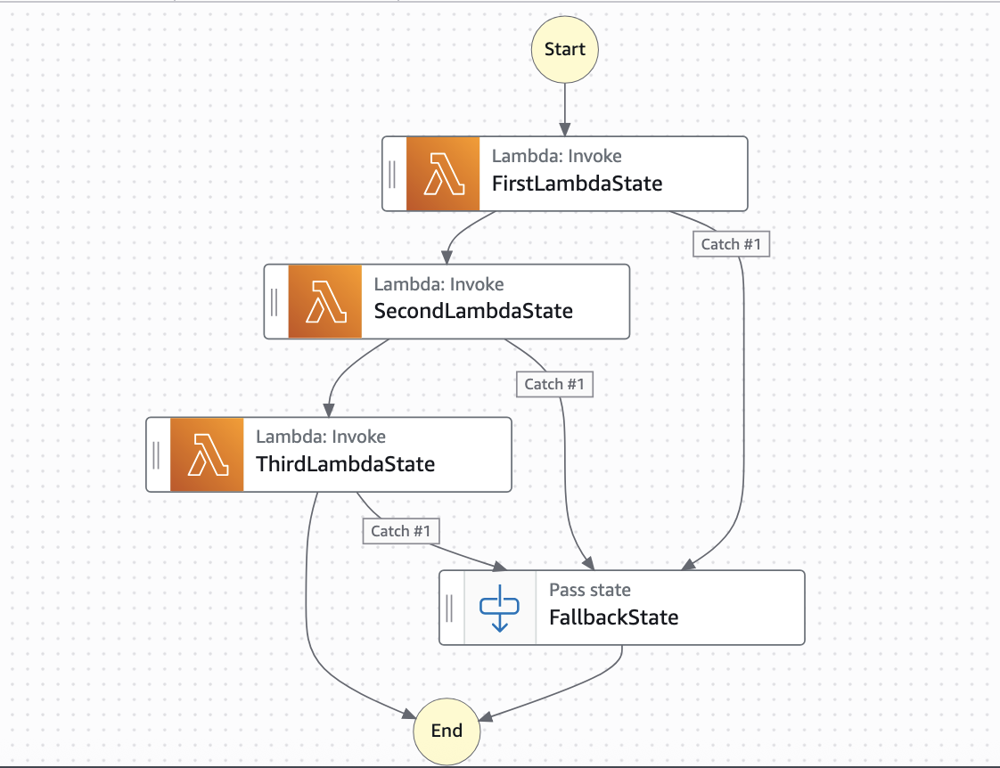

# Shared Fallback State - JSONata

This workflow shows how to fetch failed state names in JSONata StateMachine using a shared fallback state for multiple tasks. AWS Step Functions users want to implement centralized error reporting to avoid duplicating error handling logic. While setting up shared error reporting is simple, a challenge exists: the error reporting task can access error messages but cannot determine which state triggered the error. This creates issues in workflows with many Lambda functions by making it hard to identify failure points. Using JSONata, we show how to overcome this limitation and enable error tracking.

Learn more about this workflow at Step Functions workflows collection: [https://serverlessland.com/workflows/shared-fallback-state-jsonata](https://serverlessland.com/workflows/shared-fallback-state-jsonata)

Important: this application uses various AWS services and there are costs associated with these services after the Free Tier usage - please see the [AWS Pricing page](https://aws.amazon.com/pricing/) for details. You are responsible for any AWS costs incurred. No warranty is implied in this example.

## Requirements

* [Create an AWS account](https://portal.aws.amazon.com/gp/aws/developer/registration/index.html) if you do not already have one and log in. The IAM user that you use must have sufficient permissions to make necessary AWS service calls and manage AWS resources.
* [AWS CLI](https://docs.aws.amazon.com/cli/latest/userguide/install-cliv2.html) installed and configured
* [Git Installed](https://git-scm.com/book/en/v2/Getting-Started-Installing-Git)
* [AWS Serverless Application Model](https://docs.aws.amazon.com/serverless-application-model/latest/developerguide/serverless-sam-cli-install.html) (AWS SAM) installed

## Deployment Instructions

1. Create a new directory, navigate to that directory in a terminal and clone the GitHub repository:
    ``` 
    git clone https://github.com/aws-samples/step-functions-workflows-collection
    ```
1. Change directory to the pattern directory:
    ```
    cd step-functions-workflows-collection/shared-fallback-state-jsonata
    ```
1. From the command line, use AWS SAM to deploy the AWS resources for the workflow as specified in the template.yaml file:
    ```
    sam deploy --guided
    ```
1. During the prompts:
    * Enter a stack name
    * Enter the desired AWS Region
    * Allow SAM CLI to create IAM roles with the required permissions.

    Once you have run `sam deploy --guided` mode once and saved arguments to a configuration file (samconfig.toml), you can use `sam deploy` in future to use these defaults.

1. Note the outputs from the SAM deployment process. These contain the resource names and/or ARNs which are used for testing.

## How it works

The workflow doesn't require any input. By default, the third lambda function in "ThirdLambdaState" task state is intentinally programmed simulate the failure. Thus, the workflow execution fails at this task state and transitions into "FallbackState" with input as "FailedStateName": "ThirdLambdaState". 

## Image



## Testing

To test the workflow, simply start an execution of the state machine. This workflow doesn't require any input payload. Observe the execution once it has completed. In the execution, you would see that "ThirdLambdaState" has failed and the execution transitioned into "FallbackState" with input having "FailedStateName" as "ThirdLambdaState".

## Cleanup
 
1. Delete the stack
    ```
    sam delete
    ```

----
Copyright 2025 Amazon.com, Inc. or its affiliates. All Rights Reserved.

SPDX-License-Identifier: MIT-0
