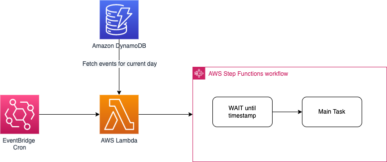
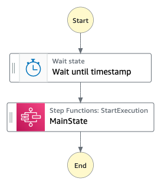

# Smart cron job using AWS Step Functions

This application demonstrates how to use AWS Step Function to build a smart cron job.

## How it works?

- A DynamoDB Table is created to hold all your event with the following structure

```json
{
  "eventDate": {
    "S": "2022-06-20"
  },
  "eventId": {
    "S": "my_event_id"
  },
  "timestamp": {
    "S": "2017-06-20T20:58:00Z"
  },
  "any_other_field1": {
  },
  "any_other_field2": {
  }
  ,
  "any_other_fieldn": {
  }
}
```

- Every day at 00:01 an Event Bridge cron will trigger the Lambda which will query the table to get all the events for that specific day.
- For each event scheduled to run that day, an instance of the Step Function will be triggered and will execute the first state which represents a wait until the specific timestamp for the event is reached.
- Once the timestamp is reached, the second step is trigered which is another step function. This inner Step Function should be modified to add your own logic.




## Main Step function

The Step function has 2 steps:

- wait until timestamp
- a inner Step Function which should hold the logic that you want to implement when the timestamp has been reached



## Requirements

* [Create an AWS account](https://portal.aws.amazon.com/gp/aws/developer/registration/index.html) if you do not already have one and log in. The IAM user that you use must have sufficient permissions to make necessary AWS service calls and manage AWS resources.
* [AWS CLI](https://docs.aws.amazon.com/cli/latest/userguide/install-cliv2.html) installed and configured
* [Git Installed](https://git-scm.com/book/en/v2/Getting-Started-Installing-Git)
* [AWS Cloud Development Kit](https://docs.aws.amazon.com/cdk/v2/guide/getting_started.html) (AWS CDK >= 2.2.0) Installed

## Language

Typescript

## Framework

CDK


## Deployment Instructions

1. Create a new directory, navigate to that directory in a terminal and clone the GitHub repository:

    ```bash
    git clone https://github.com/aws-samples/serverless-patterns
    ```

1. Change directory to the pattern directory:

    ```bash
    cd xxxxx
    ```

1. Install node modules:

    ```bash
    npm install
    ```

1. From the command line, use CDK to deploy the stack:

    ```bash
    cdk deploy
    ```


## Cleanup


1. Delete the stack

    ```bash
    cdk destroy
    ```

## Tutorial

See [this useful workshop](https://cdkworkshop.com/20-typescript.html) on working with the AWS CDK for typescript projects.

## Useful commands

 * `cdk ls`          list all stacks in the app
 * `cdk synth`       emits the synthesized CloudFormation template
 * `cdk deploy`      deploy this stack to your default AWS account/region
 * `cdk diff`        compare deployed stack with current state
 * `cdk docs`        open CDK documentation


Enjoy!
