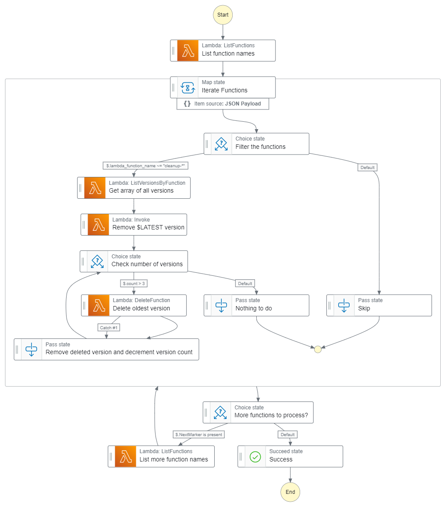

# Lambda Version Cleanup Workflow

This workflow shows how to manage/cleanup the number of available versions of an AWS Lambda function. The workflow uses the `ListFunctions`, `ListVersionsByFunction` and `DeleteFunction` SDK calls to determine which functions should be processed as well as to get to know the available number of versions and to reduce them to a specified amount. The workflow takes Lambda aliases into account as well as provides the possibility to filter which functions should be taken into account and how many versions - starting from the most recent one - should be kept available.  

Important: this application uses various AWS services and there are costs associated with these services after the Free Tier usage - please see the [AWS Pricing page](https://aws.amazon.com/pricing/) for details. You are responsible for any AWS costs incurred. No warranty is implied in this example.

## Requirements

* [Create an AWS account](https://portal.aws.amazon.com/gp/aws/developer/registration/index.html) if you do not already have one and log in. The IAM user that you use must have sufficient permissions to make necessary AWS service calls and manage AWS resources.
* [AWS CLI](https://docs.aws.amazon.com/cli/latest/userguide/install-cliv2.html) installed and configured
* [Git Installed](https://git-scm.com/book/en/v2/Getting-Started-Installing-Git)
* [Terraform](https://learn.hashicorp.com/tutorials/terraform/install-cli?in=terraform/aws-get-started) installed

## Deployment Instructions

1. Create a new directory, navigate to that directory in a terminal and clone the GitHub repository:
    ``` 
    git clone REPO_NAME
    ```
2. Change directory to the pattern directory:
    ```
    cd step-functions-lambda-versions-cleanup
    ```
3. From the command line, initialize Terraform to download and install the providers defined in the configuration:
    ```
    terraform init
    ```
4. From the command line, apply the configuration in the main.tf file:
    ```
    terraform apply -var='lambda_function_filter_prefix= '
    ```
5. During the prompts:
    * Enter yes

6. Note the outputs from the Terraform deployment process. These contain the resource names and/or ARNs which are used for testing.

## How it works



1. The state machine begins by listing all Lambda function names available in the current AWS region - pagination is taken into account.
2. It filters out functions with a defined prefix (here 'cleanup-') - can be adjusted according to the needs
3. For each filtered function, it retrieves all versions using the "ListVersionsByFunction" API call. Pagination is not taken into account here - must be added if needed - in order to keep the workflow reasonable simple.
4. The state machine then invokes a Lambda function to remove the "$LATEST" version and to sort the versions from the most recent one to the oldest.
5. It checks if the count of versions exceeds the set threshold (here three). If so, it proceeds to delete the oldest version using the "DeleteFunction" API call. Versions which cannot be deleted - e.g. due to an Lambda alias - are handled by a specific error handling specification.
6. The process repeats for all functions until there are no more functions to process, as indicated by the absence of a "NextMarker".

## Cleanup
1. Change directory to the pattern directory:
    ```bash
    cd step-functions-lambda-versions-cleanup
    ```
2. Delete all created resources
    ```bash
    terraform destroy
    ```
3. During the prompts:
    * Enter yes
4. Confirm all created resources have been deleted
    ```bash
    terraform show
    ```
