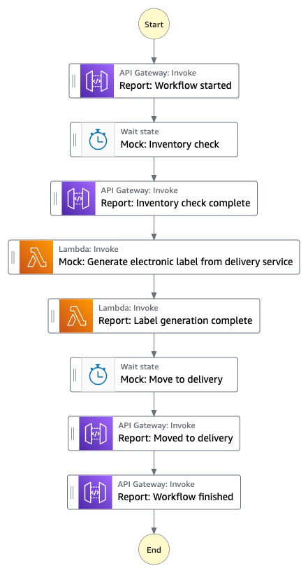

# Workflow title

This project creates an AWS Step Functions, which mocks a mutli-step ordering process, and demonstrates how clients can monitor the progress via Amazon API Gateway Websocket.

Important: this application uses various AWS services and there are costs associated with these services after the Free Tier usage - please see the [AWS Pricing page](https://aws.amazon.com/pricing/) for details. You are responsible for any AWS costs incurred. No warranty is implied in this example.

## Requirements

* [Create AWS Account](https://portal.aws.amazon.com/gp/aws/developer/registration/index.html) in case you do not have it yet or log in to an existing one
* An IAM user or a Role with sufficient permissions to deploy and manage AWS resources
* [AWS CLI](https://docs.aws.amazon.com/cli/latest/userguide/install-cliv2.html) installed and configured
* [Git Installed](https://git-scm.com/book/en/v2/Getting-Started-Installing-Git)
* [AWS Serverless Application Model](https://docs.aws.amazon.com/serverless-application-model/latest/developerguide/serverless-sam-cli-install.html) (AWS SAM) installed
* [Python](https://www.python.org/downloads/) for changing AWS Lambda functions' code
* [NPM](https://www.npmjs.com/get-npm) for changing the frontend code (React)

## Deployment Instructions

The project contains Backend and Frontend. You can deploy Backend only. The deployment of Frontend is optional. You can use a hosted Frontend for testing application [here](https://main.d3l6f007ftpjty.amplifyapp.com/). If you need to understand better how the reporting integrates with the frontend part, please refer to [this](https://github.com/aws-samples/aws-step-functions-progress-tracking/tree/main/progress-tracker-frontend) repository.

1. Create a new directory, navigate to that directory in a terminal and clone the GitHub repository:
    ``` 
    git clone https://github.com/aws-samples/step-functions-workflows-collection
    ```
1. Change directory to the pattern directory:
    ```
    cd _workflow-model
    ```
1. From the command line, use AWS SAM to deploy the AWS resources for the workflow as specified in the template.yaml file:
    ```
    sam deploy --guided
    ```
1. During the prompts:
    * Enter a stack name
    * Enter the desired AWS Region
    * Allow SAM CLI to create IAM roles with the required permissions.

    Once you have run `sam deploy --guided` mode once and saved arguments to a configuration file (samconfig.toml), you can use `sam deploy` in future to use these defaults.

1. Note the outputs from the SAM deployment process. These contain the resource names and/or ARNs which are used for testing.

## How it works

1. The Frontend asks you for Websocket endpoint URL. This is the value of WebSocketURL, that you've got from SAM template.yml deployment. Paste it into `Enter Websocket URL` field and click `Connect` button.
   The Frontend will connect to your previously deployed Backend. You can open developer tools in the browser and navigate to Networking tab, filter by `WS` (Websocket). You should see `Prod` Websocket connection open.
1. Click `Send Order` button to invoke the state machine in AWS Step Functions. You will see messages appear below the `Send Order` button coming from different stages of the state machine. Alternatively, you can observe raw messages in developer tools Networking tab of your browser. The messages will appear under `Prod` Websocket.
1. You can also trigger the state machine execution and observe progress messages by using other Websocket clients, like [Pie Socket](https://www.piesocket.com/websocket-tester). Simply enter your Websocket URL from WebSocketURL value and click connect. To start execution, specify the following message: `{ "action": "onOrder" }` and click `Send` button. The raw progress messages will appear below.
1. Additionally, you can navigate to developer tools in your browser, open `Network` tab and observe raw messages coming to the client.

## Image



## Testing

Navigate to [hosted frontend](https://main.d3l6f007ftpjty.amplifyapp.com/), paste your WebSocket API URL from the SAM deployment output and click `Connect`.
See the [GitHub repository](https://github.com/aws-samples/aws-step-functions-progress-tracking) for detailed testing instructions.

## Cleanup
 
1. Navigate to the root of the repository.
1. Delete the stack
    ```
    sam delete
    ```

----
Copyright 2022 Amazon.com, Inc. or its affiliates. All Rights Reserved.

SPDX-License-Identifier: MIT-0
