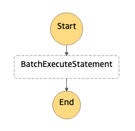

# Amazon Redshift BatchExecuteStatement

This workflow demonstrates how to use AWS Step Functions to interact with Redshift cluster directly without the use of any other service and also upload data present in a csv file in Amazon S3 directly to a table via Amazon Redshift Data API.

BatchExecuteStatement is used to run multiple SQL statements in a batch as a part of single transaction. The statements can be SELECT, DML, DDL, COPY, or UNLOAD.

Typical use cases where this pattern is helpful, are

- [ML-based predictions](https://aws.amazon.com/redshift/features/redshift-ml/)
- [Fresh forecasts](https://docs.aws.amazon.com/redshift/latest/dg/federated-overview.html)
- [Data analytics as a service](https://aws.amazon.com/redshift/features/data-sharing/?nc=sn&loc=2&dn=4)
- For more use-case in detail, please refer this [documentation](https://aws.amazon.com/blogs/big-data/power-highly-resilient-use-cases-with-amazon-redshift/)

All use cases have in common, that post processing steps require to access the query results on a file base. This pattern helps you to

1. execute set of queries
2. upload csv data present in Amazon S3 to cluster

Learn more about this workflow at Step Functions workflows collection: [https://serverlessland.com/workflows](https://serverlessland.com/workflows)

Important: this application uses various AWS services and there are costs associated with these services after the Free Tier usage - please see the [AWS Pricing page](https://aws.amazon.com/pricing/) for details. You are responsible for any AWS costs incurred. No warranty is implied in this example.

## Requirements

- [Create an AWS account](https://portal.aws.amazon.com/gp/aws/developer/registration/index.html) if you do not already have one and log in. The IAM user that you use must have sufficient permissions to make necessary AWS service calls and manage AWS resources.
- [AWS CLI](https://docs.aws.amazon.com/cli/latest/userguide/install-cliv2.html) installed and configured
- [Git Installed](https://git-scm.com/book/en/v2/Getting-Started-Installing-Git)
- [AWS Serverless Application Model](https://docs.aws.amazon.com/serverless-application-model/latest/developerguide/serverless-sam-cli-install.html) (AWS SAM) installed

## Deployment Instructions

1. Create a new directory, navigate to that directory in a terminal and clone the GitHub repository:
   ```
   git clone https://github.com/aws-samples/step-functions-workflows-collection
   ```
1. Change directory to the pattern directory:
   ```
   cd stepfunction-redshift-batchexecutestatement-sam
   ```
1. From the command line, use AWS SAM to deploy the AWS resources for the workflow as specified in the template.yaml file:
   ```
   sam deploy --guided
   ```
1. During the prompts:

   - Enter a stack name
   - Enter the desired AWS Region
   - Enter the desrired Cluster name
   - Enter the desired Step Function Name
   - Enter a unique Bucket Name
   - Enter MasterUsername for redshift cluster
   - Enter a MasterUserPassword for redshift cluster (make sure, it contains atleast one upper case, one lower case and number only) 
   - Allow SAM CLI to create IAM roles with the required permissions. 

   Once you have run `sam deploy --guided` mode once and saved arguments to a configuration file (samconfig.toml), you can use `sam deploy` in future to use these defaults.

1. Note the outputs from the SAM deployment process. These contain the resource names and/or ARNs which are used for testing.

## How it works

1. The workflow starts by starting a BatchExecuteStatement execution on Amazon Redshift cluster and inserts records which is present in a csv file in the S3 bucket.

1. In order to execute the query, the following parameter need to be provided in the execution input of your state machine.

```json
{
  "Database": "dev",
}
```

## Image



## Testing

You can start the execution of the Step Function using the following CLI command

```sh
aws stepfunctions start-execution --state-machine-arn STATE_MACHINE_ARN --input "{ \"Database\": \"dev\"}"
```

You will find the `STATE_MACHINE_ARN` in the outputs of the SAM template.

You can see the execution status via console, you will find the state machine url in the outputs section of the SAM.

Lastly, in order to view the results, you will have to use query the redshift cluster. Redshift query editor v2 link is present in the outputs section too. 

## Cleanup

1. Delete the stack
   ```bash
   sam delete --stack-name STACK_NAME
   ```

---

Copyright 2022 Amazon.com, Inc. or its affiliates. All Rights Reserved.

SPDX-License-Identifier: MIT-0
