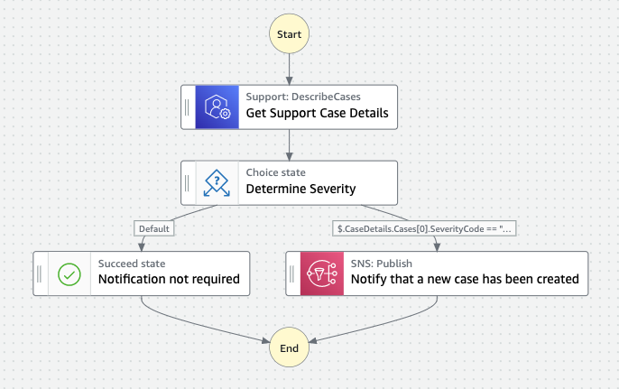

# Support Notifications

## What's here?

Choose your preferred language to work with [CDK](https://aws.amazon.com/cdk/):

* [python/](python/) - uses AWS CDK to build and deploy the infrastructure using Python

* [typescript/](typescript/) - uses AWS CDK to build and deploy the infrastructure using Typescript

See README's in specific language folders for specific requirements and deployment steps.

## What does this workflow do?

This workflow implements a notification system for when critical or urgent cases are created with [AWS Support](https://aws.amazon.com/premiumsupport/). For customers with many administrators who may be logging support cases, a manager may be interested when business critical or production systems are down. Rather than relying on the administraor to add the manager to the case, this automation sends an email notification via [Amazon SNS](https://aws.amazon.com/sns/) to the manager notifying them of the newly created urgent or critical case. The manager can then choose to login to the AWS Console, review the case and add themselves as an additional contact if they wish to receive further case updates. The workflow relies exclusively on [AWS SDK service integrations](https://docs.aws.amazon.com/step-functions/latest/dg/supported-services-awssdk.html) and contains no custom Lambda code that needs to be maintained.

## Want more?

Check out more workflows on [ServerlessLand](https://serverlessland.com/workflows)

----
Copyright 2023 Amazon.com, Inc. or its affiliates. All Rights Reserved.

SPDX-License-Identifier: MIT-0
