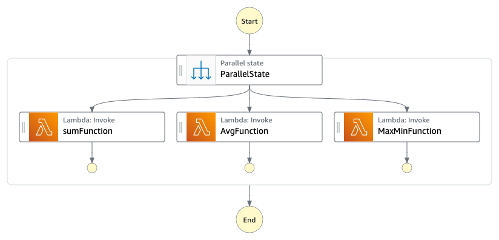

# The Synchronous API pattern

API Gateway integrates with Express workflows via asynchronous and synchronous patterns. This workflow implements the Parallel state to create multiple concurrent branches of logic. It is triggerred vua a HTTP POST request to a URL generated by API Gateway.

The Express workflow receives an array of integers as input, and in parallel calculates the sum, the average, and the maximum and minimum values. The state machine returns a JSON object with the responses from each of the parallel tasks.

The result is returned in the response of the HTTP request.



##Testing  

Send a HTTP POST request to teh URL endpoint generated by the template:

```bash
curl --location --request POST 'https://{{URL-ENDPOINT}}/' \
--header 'Content-Type: application/json' \
--data-raw '{"data": [20,40,60,10,9]}'
```

The API Gateway URL endpoint is provided in the output section of the application deployment e.g.

```bash
CloudFormation outputs from deployed stack
------------------------------------------------------------------------------------------------------------------------------------------------------------------------------------------------------------
Outputs                                                                                                                                                                                                                                                          
------------------------------------------------------------------------------------------------------------------------------------------------------------------------------------------------------------
Key                 syncronousApiStateMachine                                                                                                                                                                                                                    
Description         state machine ARN                                                                                                                                                                                                                            
Value               arn:aws:states:ap-northeast-1:123456789:stateMachine:syncronousApiStateMachine-KANHjD8WCjcV                                                                                                                                               

Key                 API                                                                                                                                                                                                                                          
Description         API Gateway endpoint URL                                                                                                                                                                                                                     
Value               https://70z7g3h2n3.execute-api.ap-northeast-1.amazonaws.com/Prod/                                                                                                                                                                            
-------------------------------------------------------------------------------------------------------------------------

```

