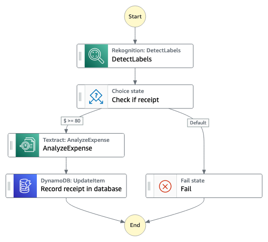

# Expense Analysis Workflow

This workflow demonstrates how to analyze the picture of an expense stored in Amazon S3 using the AnalyzeExpense API call of Amazon Textract. The extracted expense data will be persisted in DynamoDb.

Important: this application uses various AWS services and there are costs associated with these services after the Free Tier usage - please see the [AWS Pricing page](https://aws.amazon.com/pricing/) for details. You are responsible for any AWS costs incurred. No warranty is implied in this example.

## Requirements

* [Create an AWS account](https://portal.aws.amazon.com/gp/aws/developer/registration/index.html) if you do not already have one and log in. The IAM user that you use must have sufficient permissions to make necessary AWS service calls and manage AWS resources.
* [AWS CLI](https://docs.aws.amazon.com/cli/latest/userguide/install-cliv2.html) installed and configured
* [Git Installed](https://git-scm.com/book/en/v2/Getting-Started-Installing-Git)
* [Terraform](https://learn.hashicorp.com/tutorials/terraform/install-cli?in=terraform/aws-get-started) installed

## Deployment Instructions

1. Create a new directory, navigate to that directory in a terminal and clone the GitHub repository:
    ``` 
    git clone https://github.com/aws-samples/step-functions-workflows-collection
    ```
1. Change directory to the pattern directory:
    ```
    cd step-functions-workflows-collection/textract-analyze-expense-tf
    ```
1. From the command line, initialize Terraform to download and install the providers defined in the configuration:
    ```
    terraform init
    ```
1. From the command line, apply the configuration in the main.tf file:
    ```
    terraform apply
    ```
1. During the prompts:
    * Enter yes

1. Note the outputs from the Terraform deployment process. These contain the resource names and/or ARNs which are used for testing.

## How it works
This workflow demonstrates how to analyze the picture of an expense stored in the S3, extract data from the expense, and persist it in DynamoDb.



1. The workflow can be triggered either uploading an image of a receipt in the provided S3 bucket or manually starting the StepFunction with the payload described in the Testing section.

2. The image is processed using the DetectLabel API call of [Amazon Rekognition](https://aws.amazon.com/rekognition/?nc=sn&loc=0) to detect if the image contains a receipt. The sole purpose of this step is to optimize the cost reducing API calls to Textract for images which are not expenses.

3. If in the list of detected labels there is no `Receipt` label or the confidence lower than 80, then the workflow returns an error saying that the image is not a receipt.

4. Otherwise if calls the AnalyzeExpense API call of [Amazon Textract](https://aws.amazon.com/textract/) to extract the expense data from the image.

5. The workflow saves the S3 Object key, paid amount, invoce date and vendor name in the DynamoDb table created via Terraform


## Testing

There are two ways to test the Step Functions Workflow:

1. Upload a JPG image of a receipt onto the S3 Bucket deployed via Terraform. For example using the AWS CLI:
```bash
aws s3 cp my_receipt.jpg s3://textract-analyze-expense-tf-${AWS_ACCOUNT_ID}
``` 

2. Start the workflow with a test event as in the example by below. You must replace  `my_receipt.jpg` with the S3 Object key of the image already uploaded in the S3 Bucket `textract-analyze-expense-tf-${AWS_ACCOUNT_ID}`
```json
{
  "detail": {
    "bucket": {
      "name": "textract-analyze-expense-tf-${AWS_ACCOUNT_ID}"
    },
    "object": {
      "key": "my_receipt.jpg"
    }
  }
}
```
Replace `${AWS_ACCOUNT_ID}` with the AWS AccountId used to deploy the Terraform template.

 
## Cleanup
1. Change directory to the pattern directory:
    ```bash
    cd step-functions-workflows-collection/textract-analyze-expense-tf
    ```
1. Delete all created resources
    ```bash
    terraform destroy
    ```
1. During the prompts:
    * Enter yes
1. Confirm all created resources has been deleted
    ```bash
    terraform show
    ```
----
Copyright 2023 Amazon.com, Inc. or its affiliates. All Rights Reserved.

SPDX-License-Identifier: MIT-0
