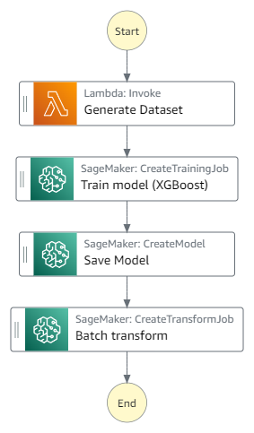

# Train ML model

This sample project demonstrates how to use Step Functions to pre-process data with AWS Lambda & store in S3, train a ML model & implement batch transformation through Sagemaker. Deploying this sample project will create an AWS Step Functions state machine, a Lambda function, S3 bucket along with required IAM roles & Log Group.

Important: this application uses various AWS services and there are costs associated with these services after the Free Tier usage - please see the [AWS Pricing page](https://aws.amazon.com/pricing/) for details. You are responsible for any AWS costs incurred. No warranty is implied in this example.

## Requirements

* [Create an AWS account](https://portal.aws.amazon.com/gp/aws/developer/registration/index.html) if you do not already have one and log in. The IAM user that you use must have sufficient permissions to make necessary AWS service calls and manage AWS resources.
* [AWS CLI](https://docs.aws.amazon.com/cli/latest/userguide/install-cliv2.html) installed and configured
* [Git Installed](https://git-scm.com/book/en/v2/Getting-Started-Installing-Git)
* [AWS Serverless Application Model](https://docs.aws.amazon.com/serverless-application-model/latest/developerguide/serverless-sam-cli-install.html) (AWS SAM) installed

## Deployment Instructions

1. Create a new directory, navigate to that directory in a terminal and clone the GitHub repository:
    ``` 
    git clone https://github.com/aws-samples/step-functions-workflows-collection
    ```
1. Change directory to the pattern directory:
    ```
    cd train-ml-model
    ```
1. From the command line, use AWS SAM to deploy the AWS resources for the workflow as specified in the template.yaml file:
    ```
    sam deploy --guided
    ```
1. During the prompts:
    * Enter a stack name
    * Enter the desired AWS Region
    * Allow SAM CLI to create IAM roles with the required permissions.
    * Accept all other defaults

    Once you have run `sam deploy --guided` mode once and saved arguments to a configuration file (samconfig.toml), you can use `sam deploy` in future to use these defaults.

1. Note the outputs from the SAM deployment process. These contain the resource names and/or ARNs which are used for testing.

    * ```StateMachineName```: Name of Step Functions State Machine orchestrating the process.
    * ```StateMachineArn```:  ARN of the Step Functions State Machine orchestrating the process.

## How it works

Below are the various stages of the Step Function workflow and how it orchestrates the various steps for training an machine learning model in Sagemaker.

	a. The first stage of the Step Function workflow calls a Lambda function which generates data & processes it to create a train-test split dataset. These train & test data is places in the form of csv file in the S3 bucket.

	b. In the second stage, using SageMaker service integration, Step Function starts a Sagemaker Training job to create a logistic regression ML model for the given train dataset using XGBoost to predict the value. 

	c. Once the model is trained, it is saved to s3 bucket using Sagemaker model job in the third stage of the state machine run.

	d. In the last stage, the test data is run through a batch transformation using Sagemaker transform job and the output file is places in the S3 output location.


## Image



## Testing

Manually trigger the workflow via the Console or the AWS CLI.  The state machine ARN can be found as the ```StateMachineArn``` output and the state machine name can be found as ```StateMachineName``` in the output.

To trigger the workflow in the console, navigate to Step Functions and then click the step function name from the list of State Machines.  In the Executions panel, click Start Execution.  Click Start Execution again in the popup.  No additional input is required.

On successful execution, machine learning model content is placed in 'models/' path & transformed data is place in 'output/' path in S3 bucket.
You can also see & verify the logs generated using the Console or CLI.

## Cleanup
 
1. Empty the S3 bucket using AWS Console.


1. Delete the stack
    ```bash
    sam delete
    ```
1. During the prompts:
    ```bash
        Are you sure you want to delete the stack batch-sample in the region ```Region```? [y/N]: y
        Are you sure you want to delete the folder batch-sample in S3 which contains the artifacts? [y/N]: y
    ```
----
Copyright 2023 Amazon.com, Inc. or its affiliates. All Rights Reserved.

SPDX-License-Identifier: MIT-0
