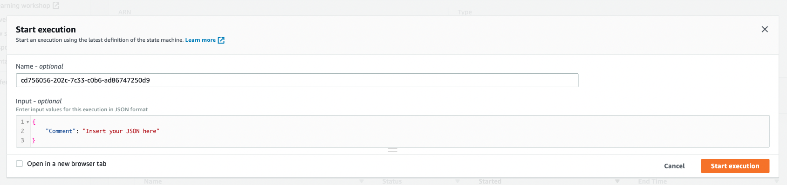

# Transfer Data Records

This sample project demonstrates how to read values from an Amazon DynamoDB table and send them to Amazon SQS using AWS Step Functions. Deploying this sample project will create a Step Functions state machine, a DynamoDB table, an AWS Lambda function, and an Amazon SQS topic.

For more Step Functions workflows check [ServerlessLand Workflows](https://serverlessland.com/workflows)

Important: this application uses various AWS services and there are costs associated with these services after the Free Tier usage - please see the [AWS Pricing page](https://aws.amazon.com/pricing/) for details. You are responsible for any AWS costs incurred. No warranty is implied in this example.

## Requirements

* [Create an AWS account](https://portal.aws.amazon.com/gp/aws/developer/registration/index.html) if you do not already have one and log in. The IAM user that you use must have sufficient permissions to make necessary AWS service calls and manage AWS resources.
* [AWS CLI](https://docs.aws.amazon.com/cli/latest/userguide/install-cliv2.html) installed and configured
* [Git Installed](https://git-scm.com/book/en/v2/Getting-Started-Installing-Git)
* [AWS Serverless Application Model](https://docs.aws.amazon.com/serverless-application-model/latest/developerguide/serverless-sam-cli-install.html) (AWS SAM) installed

## Deployment Instructions

1. Create a new directory, navigate to that directory in a terminal and clone the GitHub repository:
    ``` 
    git clone https://github.com/aws-samples/step-functions-workflows-collection
    ```
1. Change directory to the pattern directory:
    ```
    cd transfer-data-records
    ```
1. From the command line, use AWS SAM to deploy the AWS resources for the workflow as specified in the template.yaml file:
    ```
    sam deploy --guided
    ```
1. During the prompts:
    * Enter a stack name
    * Enter the desired AWS Region
    * Allow SAM CLI to create IAM roles with the required permissions.

    Once you have run `sam deploy --guided` mode once and saved arguments to a configuration file (samconfig.toml), you can use `sam deploy` in future to use these defaults.

1. Note the outputs from the SAM deployment process. These contain the resource names and/or ARNs which are used for testing.

## How it works

In this project, Step Functions uses the Lambda function to populate the DynamoDB table, uses a for loop to read each of the entries, and then sends each entry to Amazon SQS.

1.	"Seed the DynamoDB Table": Lambda function adds 10 new items to a DynamoDB table and returns a list of generated message IDs.
2.	"For Loop Condition": Choice state checks if the first element returned by the previous state is "DONE". If yes, the execution ends at "Succeed" state. If not, it proceeds to the next state.
3.	"Read Next Message from DynamoDB": Task state retrieves message data from DynamoDB using message ID.
4.	"Send Message to SQS": Task state sends message data to an SQS queue.
5.	"Pop Element from List": Pass state removes the first element returned by "Seed the DynamoDB Table" state and returns the updated array.
6.	"Succeed": Terminal state that ends the execution of the state machine.


## Image
Provide an exported .png of the workflow in the `/resources` directory from [Workflow stuio](https://docs.aws.amazon.com/step-functions/latest/dg/workflow-studio.html) and add here.


## Testing

1. Deploy the application as listed above.
2. Open the work flow in the AmWS Step Functions console. Choose **Start execution** 
1. Leave the event as is and choose **Start execution** again 

## Cleanup
 
1. Delete the stack
    ```bash
    sam delete
    ```
----
Copyright 2023 Amazon.com, Inc. or its affiliates. All Rights Reserved.

SPDX-License-Identifier: MIT-0
