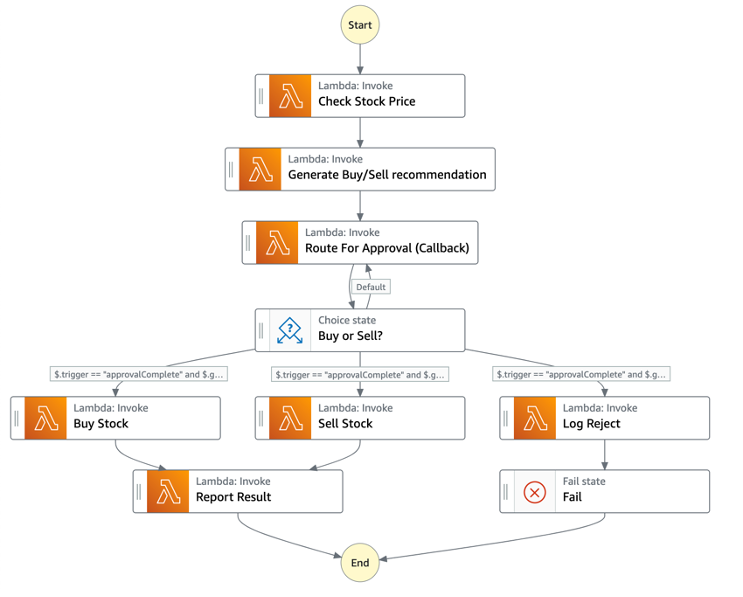
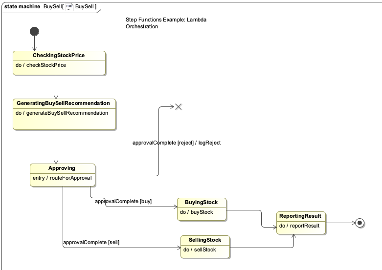

# UML State Machines in Step Functions

This repo demonstrates how to implement UML state machines using AWS Step Functions workflows. It features three Step Functions workflows demonstrating different UML state machine patterns:

**BuySell** - A flat, one-level state machine showing completion transitions and how to manage event triggers in Step Functions. This is the feature workflow, which is discussed in detail in the AWS blog post -URL to be provided-.

**ServiceRequest** - A hierarchical state machine featuring composite states, internal transitions, cancellation, transition to history. See [resources/ServiceRequest.md](resources/ServiceRequest.md)

**BackgroundChecks** - A state machine featuring orthogonal states and cancellation. See [resources/BackgroundChecks.md](resources/BackgroundChecks.md)

The UML models are in the [uml](uml) folder. The png files are screenshots of the state machines. The XML file has the models in XMI format, which should be operarable with any UML modeling tool that supports XMI. I used MagicDraw. The file contains MagicDraw extensions. Those might need to be removed before loading into a different tool.

Important: this application uses various AWS services and there are costs associated with these services after the Free Tier usage - please see the [AWS Pricing page](https://aws.amazon.com/pricing/) for details. You are responsible for any AWS costs incurred. No warranty is implied in this example.

## Requirements

* [Create an AWS account](https://portal.aws.amazon.com/gp/aws/developer/registration/index.html) if you do not already have one and log in. The IAM user that you use must have sufficient permissions to make necessary AWS service calls and manage AWS resources.
* [AWS CLI](https://docs.aws.amazon.com/cli/latest/userguide/install-cliv2.html) installed and configured
* [Git Installed](https://git-scm.com/book/en/v2/Getting-Started-Installing-Git)
* [AWS Serverless Application Model](https://docs.aws.amazon.com/serverless-application-model/latest/developerguide/serverless-sam-cli-install.html) (AWS SAM) installed

## Deployment Instructions

1. Create a new directory, navigate to that directory in a terminal and clone the GitHub repository:
    ``` 
    git clone https://github.com/aws-samples/step-functions-workflows-collection
    ```
2. Change directory to the pattern directory:
    ```
    cd uml-statemachine
    ```
3. From the command line, use AWS SAM to build and deploy the AWS resources for the workflow as specified in the template.yaml file:
    ```
    sam build
    sam deploy --guided
    ```
4. During the prompts:
    * Enter a stack name
    * Enter the desired AWS Region
    * Allow SAM CLI to create IAM roles with the required permissions.

    Once you have run `sam deploy --guided` mode once and saved arguments to a configuration file (samconfig.toml), you can use `sam deploy` in future to use these defaults.

5. Note the outputs from the SAM deployment process. These contain the resource names and/or ARNs which are used for testing.

## How it works

`BlogBuySell` implements a UML state machine that models the behavior of a buy-sell stock order. It demonstrates how a Step Functions workflow implements UML state activities, event dispatch, guards, transition activities, fail states, and completion transitions. Its design, and how it traces back to its UML model, is discussed in depth in the blog post -URL to be included-.

For a description of `ServiceRequest`, see [resources/ServiceRequest.md](resources/ServiceRequest.md). 

For a description of `BackgroundChecks`, see [resources/BackgroundChecks.md](resources/BackgroundChecks.md).


## Image


It implements this UML state machine



## Testing

The AWS blog post -URL to be included- walks through how to test the `BlogBuySell` workflow.

To test `ServiceRequest`, see [resources/ServiceRequest.md](resources/ServiceRequest.md). 

To test `BackgroundChecks`, see [resources/BackgroundChecks.md](resources/BackgroundChecks.md).

## Cleanup
 
1. Delete the stack
    ```bash
    aws cloudformation delete-stack --stack-name STACK_NAME
    ```
2. Confirm the stack has been deleted
    ```bash
    aws cloudformation list-stacks --query "StackSummaries[?contains(StackName,'STACK_NAME')].StackStatus"
    ```

## References
- Miro Samek, Practical UML Statecharts in C/C++, 2d Ed. Elsevier, 2009. https://www.amazon.com/Practical-UML-Statecharts-Event-Driven-Programming/dp/0750687061
- David Harel, "Statecharts: A Visual Formalism for Complex System" in Science of Computer Programming, Elsevier, 1987, Vol 8, 231-274. https://www.sciencedirect.com/science/article/pii/0167642387900359/pdf?md5=86d7815b349b738c8ed12b3fdecf4c71&pid=1-s2.0-0167642387900359-main.pdf
- Object Management Group, OMG UML Superstructure, V2.1.2, 2007. http://www.omg.org/spec/UML/2.1.2/Superstructure/PDF/.
- E. Borger, A. Cavarra, E. Riccobene, "Modeling the Dynamics of UML State Machines" in Abstract State Machines, Theory and Applications, International Workshop, ASM 2000, Proceedings. Springer-Verlag,2000, Vol 1912, 223-241. https://citeseerx.ist.psu.edu/viewdoc/download?doi=10.1.1.101.8282&rep=rep1&type=pdf

----
Copyright 2022 Amazon.com, Inc. or its affiliates. All Rights Reserved.

SPDX-License-Identifier: MIT-0
