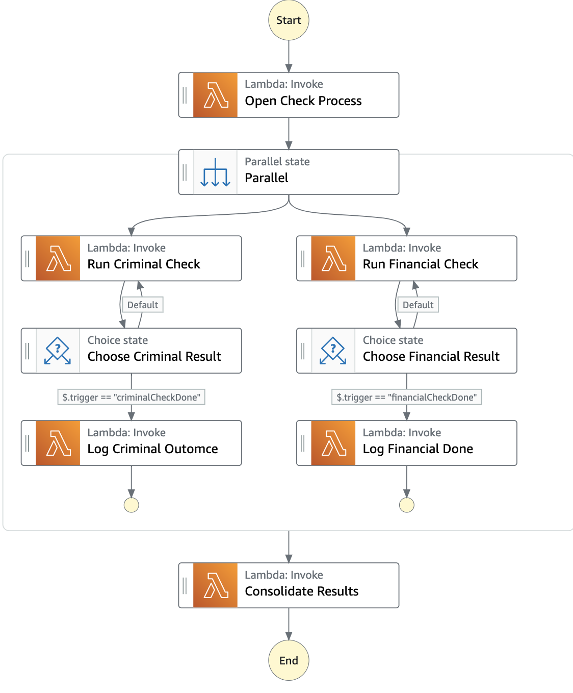
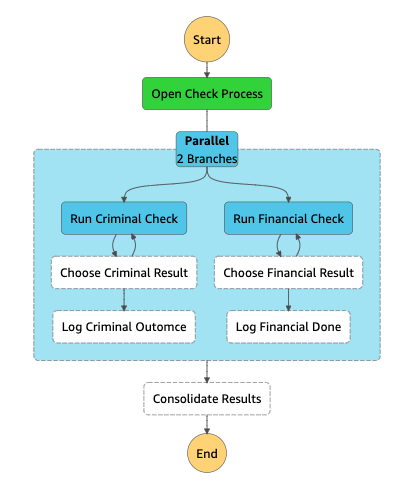
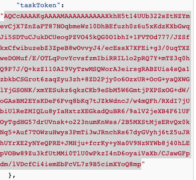
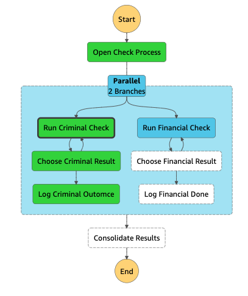
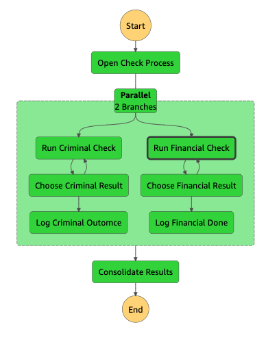

# BackgroundChecks State Machine

`BackgroundChecks` is a UML state machine that models parallel behavior using an **orthogonal** state. The next figure shows the UML model, representing background checks.


 
There are only two main states: `RunningChecks` and `Cancelled`. `RunningChecks` is orthogonal and consists of two **regions**, which execute in parallel: `CheckingCriminal` and `CheckingFinancial`. When both complete, `RunningChecks` also completes and we transition to the final state, running the transition activity `consolidateResults`. 

Locate the Step Functions state machine whose name starts with `BlogBackgroundChecks`, shown in the next figure:



Execute the `BlogServiceRequest` state machine by choosing **Start Execution** for that state machine in the Step Functions console.  Use the following input:

```
{ "appData": "Insert your JSON here"}
```

Confirm in the **Graph View** that it stops in `Run Criminal Check` and `Run Background Check`. 



In the **Event View**, find the **Task Input** for `Run Criminal Check`. Copy the `taskToken` value, excluding the double quotes. Your value will be different from that shown in the diagram.



In the Lambda console, find the function whose name contains `BlogDummyUMLEventDispatcher`. In the **Test** tab, create an event whose **Event JSON** resembles the following; paste your task token where indicated.

```
{
  "taskToken": "<paste your task token here>",
  "trigger": "criminalCheckDone",
  "appData": {
    "x": "y"
  }
}
```

Choose **Test** to call the Lambda function with that input. It triggers the workflow. When it completes, return to the **Graph View** of the Step Functions workflow. It has now completed the `Run Criminal Check` path of the flow, but it is still paused at `Run Financial Check`.



Find the task token for `Run Financial Check` -- it will be different from the token for `Run Criminal Check` -- and in the Lambda console create a test event of the following form using the task token.

```
{
  "taskToken": "<paste your task token here>",
  "trigger": "financialCheckDone",
  "appData": {
    "x": "y"
  }
}
```

Choose **Test** to call the Lambda function with that input. It triggers the workflow. The workflow is complete.



As an exercise, confirm that the Step Functions workflow traces back to the UML model. The best way to check tracing is the **Event View** in **Task Scheduled** events.
- UML state entry activity `openCheckProcess` in state `RunningChecks` can be found in `OpenCheckProcess` step of the workflow.

```
     "sourceState": "RunningChecks",
      "activityType": "stateEntry",
      "activityName": "openCheckProcess",
 ``` 

- UML state entry activity `startCriminalCheck` in state `PendingCompletion` of state `CheckingCriminal` can be found in `Run Criminal Check` step of the workflow.
- UML state entry activity `startFinancialCheck` in state `PendingCompletion` of state `CheckingFinancial` can be found in `Run Financial Check` step of the workflow.
- UML transition activity `criminalCheckDone` can be found in `Log Criminal Outcome` step of the workflow.
- UML transition activity `financialCheckDone` can be found in `Log Financial Outcome` step of the workflow.
- UML transition activity `consolidateResults` can be found in `Consolidate Results` step of the workflow.

Here are some design notes on the Step Functions implementation:
- The orthogonal regions are represented using a parallel state, the left side handling criminal checks, the right side financial.  In general, if the logic of a region is sufficiently complex, it can be moved into its own Step Function state machine and invoked such that the parent machine waits for it to complete.
- We have two callbacks at once: one for `Run Criminal Check`, another for `Run Financial Check`.  Each has its own token.
- As opposed to explicit cancellation handling in the `Service Request` implementation, cancellation here is handled outside the state machine. To cancel the background checks, the external actor stops the state machine using the Step Functions API. The UML model requires a transition activity called `recordCancellation`, the external actor needs to implement that logic too. External cancellation is a good choice when wrapup logic is simple; it leverages the API rather than complicating the flow with cancellation detail.

## Patterns Demonstrated
- Parallel or orthogonal states
- Cancellation events handled outside the flow using SDK
