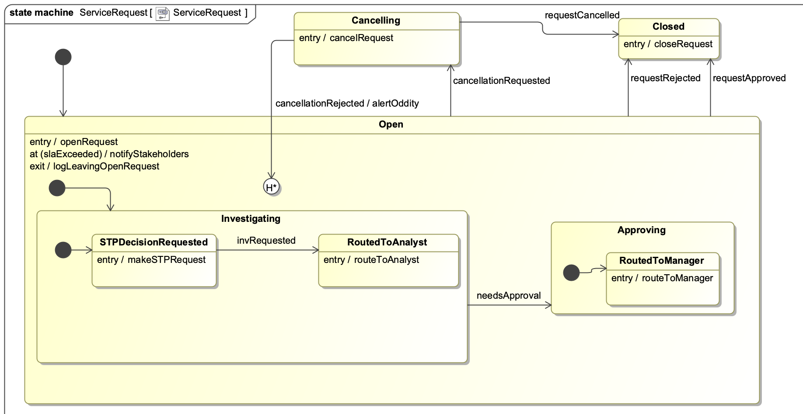
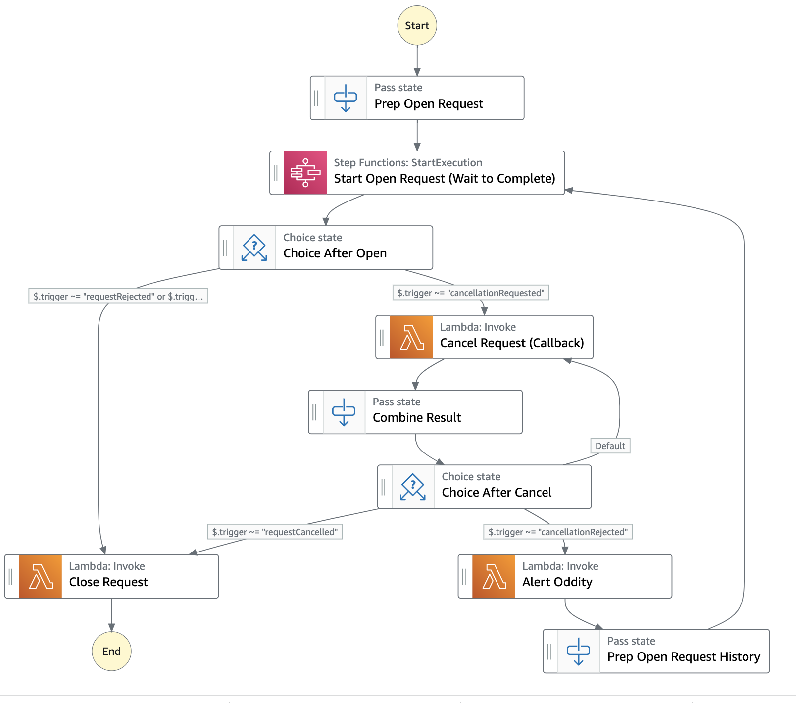
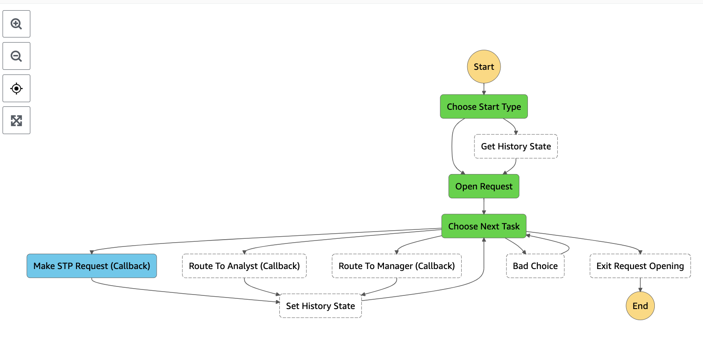
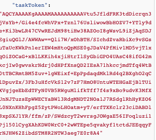
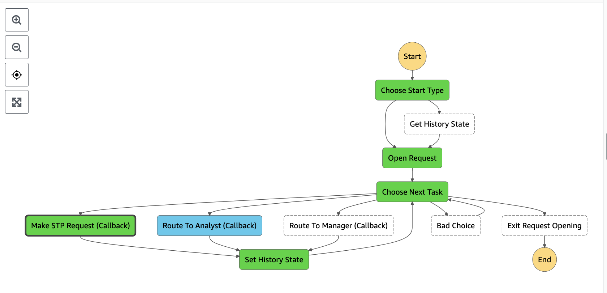
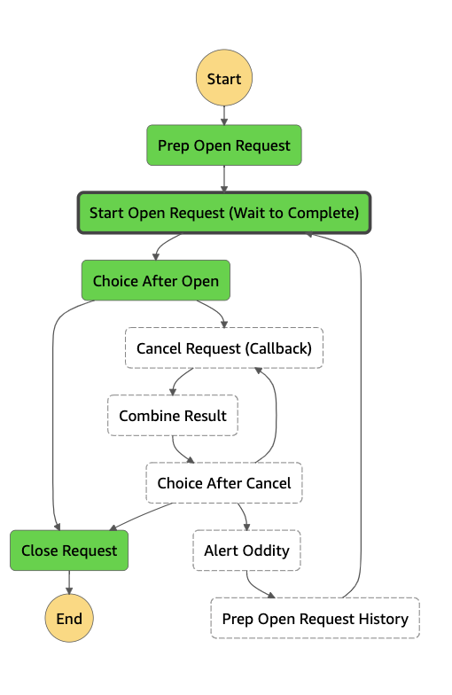

# ServiceRequest State Machine

`ServiceRequest` is the state machine for an organization’s handling of a Service Request, such as a customer claim or an internal purchase. The next figure shows the UML state machine. It has three main states:  `Open`, `Cancelling` and `Closed`. There are several transitions among them. `Open` is a **composite** state consisting of two substates: `Investigating` and `Approving`. Each of these, turn, is a composite. `Investigating` has substates `STPDecisionRequested` and `RoutedToAnalyst`. Approving has substate `RoutedToManager`. 



Here are a few design notes about this model:
-	`Open` has an internal transition when the timer `slaExceeded` fires. The activity `notifyStakeholders` is run. This does not interrupt the rest of the processing. 
-	The `needsApproval` transition can trigger in any substate of `Investigating`. The `requestedRejected`, `requestApproved`, and `cancellationRequested` transitions can trigger in any substate of `Open`. 
-	The `cancellationRejected` transition moves from `Cancelling` to `Open`. The state machine must have been in `Open` previously, otherwise it could not have ended up in `Cancelling`. Notice that this transition points to a peculiar circle with an “H”. This is a **deep history** state. The states and substates of `Open` that were most recently active should become active again. For example, if `Investigating` was the most recent substate of `Open`, and `RoutedToAnalytst` was the most recent substate of `nvestigating`, this former state should be restored. 

In the Step Functions console, find the state machines whose names start with `BlogServiceRequest` and `BlogOpenRequest`. Open for edit the main state machine, `BlogServiceRequest`, which implements the three main states and their transitions.



Its first task is `Start Open Request`, which calls the `BlogOpenRequest` state machine to process the opening of the request. Initially it is called in initial/non-historical mode. When that processing completes, `Choice After Open` branches in one of two directions and invokes Lambda tasks  `Close Request` or `Cancel Request`. When `Cancel Request` completes, it branches, via `Choice After Cancel`, to either `Close Request` or `Lambda task Alert Oddity` (and then back to `Start Open Request`, now called in historical mode passing its last trigger as input).

Here are two important design points:
-	We call the state machine `BlogOpenRequest` using the integration pattern **Wait for child execution to complete**. This state machine has nothing to do while the child is executing, so that pattern fits. In general, the parent might need to continue processing after calling the child. Two possible approaches are to run the child state machine in parallel to a callback task, or run the child machine in the background using **call-and-continue**.
-	`Cancel Request` uses a callback to wait for the next application event; it uses the same event pattern as the `BuySell` example. 

Next open for edit the `BlogOpenRequest` state machine. It is shown in the next figure.


 
Some salient design points include:
-	This implementation is flat -- one level deep -- whereas the `Open` state in the UML model is hierarchical, having two composite children, each with substates  -- thus, two levels deep. The implementers thought this simpler to implement without sacrificing behavior. 
-	The **event loop** pattern. The three main activities of opening a request: making the STP request, routing to analyst, and routing to manager are arranged in a conditional loop. This simplifies the routing among them. The `Open` state in the UML model allows several possible paths, and it gets more complicated when history is factored in. Letting the next event decide which to execute next results in a cleaner flow. In general, state machines can involve a complicated graph of activities which, if not structured in a careful way, can result in an unreadable mess of boxes and arrow. The event loop pattern simplifies the flow.
-	The **transition to history** pattern. The state machine can be started in two modes: initial or history. In the latter case, the state machine accepts its last trigger as input. The event loop routes to the last trigger, which runs whichever of `Make STP Decision`, `Route To Analyst`, `Route To Manager` was most recently visited.  In initial mode, `Make STP Decision` is selected. 
-	The `Open` state in the UML model has an exit activity. The Step Functions implementation invokes a Lambda function in `Exit Request Opening` to execute that activity before completing the flow.
-	The UML model has an **internal transition** that fires when the SLA is exceeded. The design team decided to build this logic outside the Step Functions state machine. Rather than complicate the flow in Step Functions, the team intends to build in the next sprint an external cron-trigger using Amazon EventBridge to implement this logic. In general, EventBridge is a suitable service for triggering timed events. 

Execute the `BlogServiceRequest` state machine by choosing **Start Execution** for that state machine in the Step Functions console.  Use the following input:

{ "appData": "Insert your JSON here"}

Notice it stops immediately in `Start Open Request`.


 
In a separate browser tab, find the most recent execution of the `BlogOpenRequest` state machine in the Step Functions console.  Notice it is stopped in `Make STP Request`. 


 

In the **Event View**, find the **Task Input** for `Make STP Request`. Copy the `taskToken` value, excluding the double quotes. Your value will be different from that shown in the diagram.



In the Lambda console, find the function whose name contains `BlogDummyUMLEventDispatcher`. In the **Test** tab, create an event whose **Event JSON** resembles the following; paste your task token where indicated.
```
{
  "taskToken": "<paste token here>",
  "trigger": "invRequested",
  "appData": {
    "x": "y"
  }
}
```
Choose **Test** to call the Lambda function with that input. It triggers the workflow. When it completes, return to the **Graph View** of the Step Functions workflow. The graphical view shows that `BlogOpenRequest` is now stopped at `Routed To Analyst`. 



Find the task token for `Route To Analyst`. In the Lambda console, send another test event, this time with trigger `requestApproved` and the task token from `Routed To Analyst`, which will be different from the previous task token.

```
{
  "taskToken": "<paste token here>",
  "trigger": "requestApproved",
  "appData": {
    "x": "y"
  }
}
```

Confirm that the `BlogOpenRequest` execution is complete.  


Next check the `BlogServiceRequest` execution. It should be complete too.



As an exercise, confirm that the Step Functions workflow traces back to the UML model. The best way to check tracing is the **Event View** in **Task Scheduled** events. You will need to check the traces of both `ServiceRequest` and `BlogOpenRequest`. The complete trace back to UML is the following:
- UML state entry activity `openRequest` in state `Open` can be found in `OpenCheckProcess` step of the `BlogOpenRequest` workflow.

```
      "sourceState": "Open",
      "activityType": "stateEntry",
      "activityName": "openRequest",
``` 
- UML state entry activity `makeSTPRequest` in state `Open.Investigating.STPDecisionRequested` can be found in `Make STP Request` step of the `BlogOpenRequest` workflow.
- UML state entry activity `routeToAnalyst` in state `Open.Investigating.RoutedToAnalyst` can be found in `Route To Analyst` step of the `BlogOpenRequest` workflow.
- UML state exit activity `logLeavingOpenRequest` in state `Open` can be found in `Exit Request Opening` step of the `BlogOpenRequest` workflow.
- UML state exit activity `closeRequest` in state `Closed` can be found in `Close Request` step of the `ServiceRequest` workflow.


## Patterns Demonstrated
- Hierarchical or composite states
- Cancellation events handled explicitly in flow
- Internal transitions
- Transition to history
- Using an event loop for complex flow

