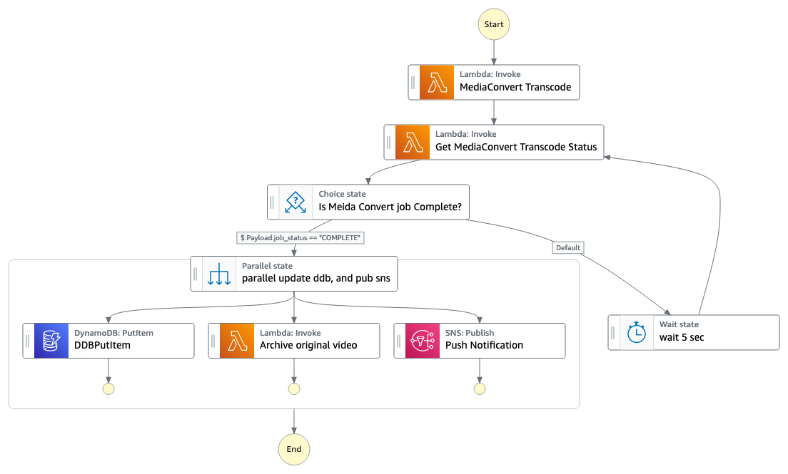
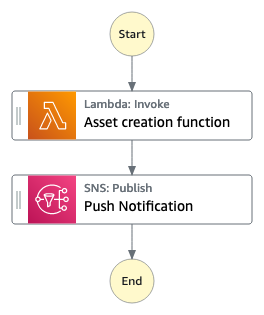

# Video-on-demand transcoding and delivery serveless backend

This AWS CDK script (TypeScript) automatically creates a Video-on-demand serverless infrastructure. The following instructions detail how to deploy the template containing the step function state machine.

Learn more about this workflow at the Step Functions workflows collection: https://serverlessland.com/workflows/vot-transcode-delivery-cdk

## Requirements

* [Create an AWS account](https://portal.aws.amazon.com/gp/aws/developer/registration/index.html) if you do not already have one and log in. The IAM user you use must have sufficient permissions to make necessary AWS service calls and manage AWS resources.
* [AWS CLI](https://docs.aws.amazon.com/cli/latest/userguide/install-cliv2.html) installed and configured
* [Git Installed](https://git-scm.com/book/en/v2/Getting-Started-Installing-Git)
* [AWS CDK Installed](https://docs.aws.amazon.com/cdk/v2/guide/getting_started.html#getting_started_install)

## Deployment Instructions

1. If this is your first time using AWS CDK, bootstrap your [environment](https://docs.aws.amazon.com/cdk/v2/guide/getting_started.html#getting_started_bootstrap).

    ```bash
    cdk bootstrap aws://{your-aws-account-number}/{your-aws-region}
    ```

2. Create a new directory, navigate to that directory in a terminal, and clone the GitHub repository:

    ```bash
    git clone https://github.com/aws-samples/step-functions-workflows-collection
    ```

3. Change directory to the pattern directory:

    ```bash
    cd vot-transcode-delivery-cdk/typescript
    ```

4. For the `sharedResourcesStack` stack, replace the `subEmail` variable with your own Email address.

5. From the command line, use npm to install dependencies and run the build process for the Lambda functions.

    ```bash
    npm install
    npm run build
    ```

6. From the command line, use CDK to deploy the AWS resources for the workflow as specified in the TypeScript files under `/lib` and `/bin/vod-workflow.ts`:

    ```bash
    cdk deploy --all
    ```

7. During the prompts:

    ```text
    Do you wish to deploy these changes (y/n)? Y
    ```

## How it works

The step function for the transcoding workflow orchestrates the AWS Elemental MediaConvert service process:
A lambda function will be inovked once you upload a video to source S3 bucket. The particular lambda function will trigger the stepfunction

1. Initiates the media transcoding process by invoking a Lambda function responsible for submitting a MediaConvert job. 
2. Checks the status of the MediaConvert job by invoking another Lambda function.
3. Updates a DynamoDB table with information about the video, such as video_id, video_name, and job_status.
4. Invokes a Lambda function to archive the original video.
5. Publishes a message to an SNS topic with the payload of the previous states. After this state, the state machine ends.

The step function for the packaging workflow orchestrates is triggered by AWS EventBrigde rule. The Rule listens to AWS Elemental MediaConvert job completion. 
The process of creating an asset for an AWS Elemental MediaPackage packing group:
1. Initiates the asset creation process by invoking a Lambda function responsible for creating an asset.
2. Publishes a message to an SNS topic with the payload from the previous "Asset creation function" state. After this state, the state machine ends.

## Images



## Testing
Upload a video to the source bucket to trigger the workflow. The source bucket name can be found in the output of the `MediaTranscodeStack` with the key `SourceS3Bucket`. You should receive an


## Clean up
Delete the stack: 
    ```bash
    cdk destroy --all 
    ```

During the process: 
    ```
    Are you sure you want to delete: DeliverChannelStack, MediaTranscodeStack, ErrorHandlerStack, SharedResourcesStack (y/n)? y
    ```