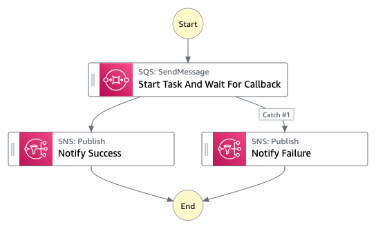

# The wait for callback pattern

The Wait for Callback feature provides a way to pause a workflow indefinitely until a task token is returned.

For example, a task might require human approval, integrate with a third party, or call a legacy system. For workflows like these, a task can pass a unique token to the service integration and pause. The task will only resume when it receives the task token back with a SendTaskSuccess or SendTaskFailure call. To see a list of the integrated services that support Wait for Callback (.waitForTaskToken), see Optimized integrations for Step Functions.

##Testing  

