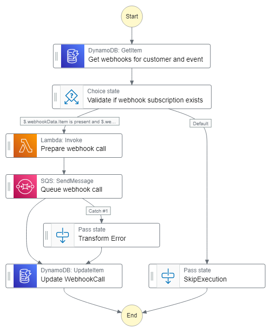

# Webhook provider service using AWS Step Functions

This workflow implements a webhook provider service using AWS Stepfunctions.

A webhook provider is a service or system that offers the capability to send outgoing webhook notifications to external systems or applications. A webhook is an HTTP callback that sends a notification to a predefined URL (endpoint) when a specific event or trigger occurs. Webhooks allow real-time communication and data exchange between different systems or services.

Learn more about this workflow at Step Functions workflows collection: << Add the live URL here >>

Important: this application uses various AWS services and there are costs associated with these services after the Free Tier usage - please see the [AWS Pricing page](https://aws.amazon.com/pricing/) for details. You are responsible for any AWS costs incurred. No warranty is implied in this example.

## Requirements

* [Create an AWS account](https://portal.aws.amazon.com/gp/aws/developer/registration/index.html) if you do not already have one and log in. The IAM user that you use must have sufficient permissions to make necessary AWS service calls and manage AWS resources.
* [AWS CLI](https://docs.aws.amazon.com/cli/latest/userguide/install-cliv2.html) installed and configured
* [Git Installed](https://git-scm.com/book/en/v2/Getting-Started-Installing-Git)
* [AWS Serverless Application Model](https://docs.aws.amazon.com/serverless-application-model/latest/developerguide/serverless-sam-cli-install.html) (AWS SAM) installed

## Deployment Instructions

1. Create a new directory, navigate to that directory in a terminal and clone the GitHub repository:
    ``` 
    git clone https://github.com/aws-samples/step-functions-workflows-collection
    ```
1. Change directory to the pattern directory:
    ```
    cd webhook-provider
    ```
1. From the command line, use AWS SAM to deploy the AWS resources for the workflow as specified in the template.yaml file:
    ```
    sam deploy --guided
    ```
1. During the prompts:
    * Enter a stack name
    * Enter the desired AWS Region
    * Allow SAM CLI to create IAM roles with the required permissions.

    Once you have run `sam deploy --guided` mode once and saved arguments to a configuration file (samconfig.toml), you can use `sam deploy` in future to use these defaults.

1. Note the outputs from the SAM deployment process. These contain the resource names and/or ARNs which are used for testing.

## How it works

When an event that matches the configured filter conditions is triggered, the step function handles the flow of retrieving event data and validates if the customer has set up a webhook subscription for the event. If a valid subscription exists, it prepares the webhook call, queues the call, and updates the webhook call entry in DynamoDB.The queue entry triggers a lambda function that calls the webhook. The retry interval and count along with backoff settings can be configured.

## Image
 


## Testing

* [Put Events] (https://docs.aws.amazon.com/eventbridge/latest/APIReference/API_PutEvents.html#API_PutEvents_Examples) into the configured event bus and matching filter criteria.
* The workflow ends if there is a no valid subscription for the customer and event type.
* If there is an entry The Workflow logs the call entry into dynamodb and queues a call to the webhook.
* If the webhook call succeeds, the dynamodb entry for the call is marked success.
* If the webhook call fails, the workflow retries the call as per the configured count and delay. 
* If the webhook call does not succeed after retries, the dynamodb entry for the call is marked as failure.


## Cleanup
 
1. Delete the stack
    ```bash
    aws cloudformation delete-stack --stack-name STACK_NAME
    ```
1. Confirm the stack has been deleted
    ```bash
    aws cloudformation list-stacks --query "StackSummaries[?contains(StackName,'STACK_NAME')].StackStatus"
    ```
----
Copyright 2023 Amazon.com, Inc. or its affiliates. All Rights Reserved.

SPDX-License-Identifier: MIT-0
