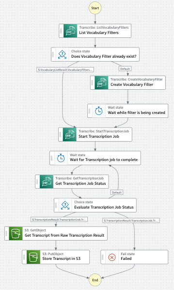

# Word Filtering Script Generator

## What's here?

Choose your preferred language to work with [CDK](https://aws.amazon.com/cdk/):

* [python/](python/) - uses AWS CDK to build and deploy the infrastructure using Python

* [typescript/](typescript/) - uses AWS CDK to build and deploy the infrastructure using Typescript

See README's in specific language folders for specific requirements and deployment steps.

## What does this workflow do?

This workflow generates scripts that filters certain words from video or audio. When you specify the words you wish to filter, [Amazon Transcribe](https://aws.amazon.com/transcribe/) recognizes the word and marks it as `***` in the transcript.
This feature is useful when you want to erase swear words or slang when creating movie subtitles, or when you want to hide certain words.

1. Based on the words you added to a variable in the CDK application, an [Amazon Transcribe](https://aws.amazon.com/transcribe/) vocabulary filter will be created. When Transcribe recognizes a word from this filter, it marks it as '***' in the transcript.
1. When a video is uploaded to [Amazon S3](https://aws.amazon.com/s3/) it triggers this workflow.
1. The workflow checks to see if the [Amazon Transcribe](https://aws.amazon.com/transcribe/) vocabulary filter has already been created, otherwise it creates it before proceeding.
1. An [Amazon Transcribe](https://aws.amazon.com/transcribe/) transcription job is created using the `StartTranscriptionJob` API.
1. The workflow then periodically checks to see if the job has completed.
1. Once complete, the job downloads the results of the transcription job and extracts the transcript, ignoring the other transcription metadata.
1. The transcript text is then stored in a separate file on [Amazon S3](https://aws.amazon.com/s3/).

## Want more?

Check out more workflows on [ServerlessLand](https://serverlessland.com/workflows)

----
Copyright 2023 Amazon.com, Inc. or its affiliates. All Rights Reserved.

SPDX-License-Identifier: MIT-0
