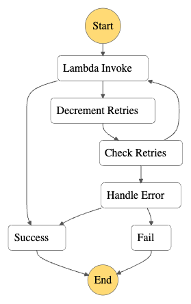

# Dynamic Retries and Error Handling

This workflow showcases a way to implement retries configurable at runtime.

It consists of two AWS Lambda functions - one that implements the business
logic, and one that handles errors beyond the specified number of retries. The
way to specify number of retries is by wrapping the original payload.

**Example:**

If the payload for the business logic Lambda function is:

```JSON
{
  "failureRate": 1
}
```

The wrapped payload that will serve as input into the workflow execution would
be:

```JSON
{
  "retries": 3,
  "payload": {
    "failureRate": 1
  }
}
```

Here, we specify that we want the business logic Lambda function to retry 3
times upon failure.

Through Input and Output data processing, the business logic Lambda function
will only get the intended payload, and the wrapper will be re-applied after
its execution, for subsequent checks.

For more Step Functions workflows check [ServerlessLand Workflows](https://serverlessland.com/workflows)

Important: this application uses various AWS services and there are costs associated with these services after the Free Tier usage - please see the [AWS Pricing page](https://aws.amazon.com/pricing/) for details. You are responsible for any AWS costs incurred. No warranty is implied in this example.

## Requirements

* [Create an AWS account](https://portal.aws.amazon.com/gp/aws/developer/registration/index.html) if you do not already have one and log in. The IAM user that you use must have sufficient permissions to make necessary AWS service calls and manage AWS resources.
* [AWS CLI](https://docs.aws.amazon.com/cli/latest/userguide/install-cliv2.html) installed and configured
* [Git Installed](https://git-scm.com/book/en/v2/Getting-Started-Installing-Git)
* [AWS Serverless Application Model](https://docs.aws.amazon.com/serverless-application-model/latest/developerguide/serverless-sam-cli-install.html) (AWS SAM) installed

## Deployment Instructions

1. Create a new directory, navigate to that directory in a terminal and clone the GitHub repository:
    ```bash 
    git clone https://github.com/aws-samples/step-functions-workflows-collection
    ```
2. Change directory to the pattern directory:
    ```bash
    cd workflow-error-handling-and-retries
    ```
3. From the command line, use AWS SAM to deploy the AWS resources for the
   workflow as specified in the template.yaml file:
    ```bash
    sam deploy --guided
    ```
4. During the prompts:
    * Enter a stack name
    * Enter the desired AWS Region
    * Allow SAM CLI to create IAM roles with the required permissions.

    Once you have run `sam deploy --guided` mode once and saved arguments to a
    configuration file (samconfig.toml), you can use `sam deploy` in future to
    use these defaults.

5. Note the outputs from the SAM deployment process. These contain the resource
   names and/or ARNs which are used for testing.

## How it works



After invoking the Lambda function and the function resulting in failure, the
Decrement Retries step uses Amazon States Language Intrinsics to reduce the
number of retries tracked in the payload. The Check Retries state checks if the
number of remaining retries is greater than zero. If so, it transitions to the
Lambda Invoke state again. In case the number of remaining retries is zero, it
transitions to the Handle Error state which invokes the error-handling Lambda
function.

The workflow failure state is reserved only for complete failures, including
the failure of the error-handler. If the error-handler succeeds in executing,
the workflow finishes in the success state. This reflects a successful "catch"
of an Exception in most programming languages.


## Testing

### Unit testing

1. Install pytest
```bash
python -m pip install pytest
```

2. Run pytest
```bash
python -m pytest ./tests/
```

### Integration testing

1. Go to the AWS [Step Functions Console](https://console.aws.amazon.com/states/home) and find the State Machine from the SAM output.

2. Select `Start Execution` and use a valid JSON data as input similar to the below:
  ```
  {
    "retries": 3,
    "payload": {
      "failureRate": 1
    }
  }
  ```
  This will execute the workflow with the business logic Lambda function
  failing three consecutive times.

3. Modify the `failureRate` value to 0 to have the workflow run through the
   path without retries.

4. Modify the `failureRate` value to a floating point number between 0 and 1
   to see a nondeterministic execution.

## Cleanup
 
1. Delete the stack
    ```bash
    sam delete
    ```

----
Copyright 2023 Amazon.com, Inc. or its affiliates. All Rights Reserved.

SPDX-License-Identifier: MIT-0
