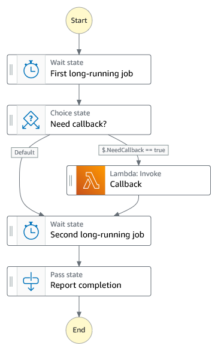

# Start a Workflow within a Workflow

This sample project demonstrates how to use an AWS Step Functions state machine to launch other state machine executions.

The state machine combines workflows using a Step Functions StartExecution task state with various integration patterns.

Learn more about this workflow at Step Functions workflows collection: << Add the live URL here >>

Important: this application uses various AWS services and there are costs associated with these services after the Free Tier usage - please see the [AWS Pricing page](https://aws.amazon.com/pricing/) for details. You are responsible for any AWS costs incurred. No warranty is implied in this example.

## Requirements

* [Create an AWS account](https://portal.aws.amazon.com/gp/aws/developer/registration/index.html) if you do not already have one and log in. The IAM user that you use must have sufficient permissions to make necessary AWS service calls and manage AWS resources.
* [AWS CLI](https://docs.aws.amazon.com/cli/latest/userguide/install-cliv2.html) installed and configured
* [Git Installed](https://git-scm.com/book/en/v2/Getting-Started-Installing-Git)
* [AWS Serverless Application Model](https://docs.aws.amazon.com/serverless-application-model/latest/developerguide/serverless-sam-cli-install.html) (AWS SAM) installed

## Deployment Instructions

1. Create a new directory, navigate to that directory in a terminal and clone the GitHub repository:
    ``` 
    git clone https://github.com/aws-samples/step-functions-workflows-collection
    ```
1. Change directory to the pattern directory:
    ```
    cd workflow-within-a-workflow
    ```
1. From the command line, use AWS SAM to build and deploy the AWS resources for the workflow as specified in the template.yaml file:
    ```
    sam build
    sam deploy --guided
    ```
1. During the prompts:
    * Enter a stack name
    * Enter the desired AWS Region
    * Allow SAM CLI to create IAM roles with the required permissions.
    * Accept all other defaults

    Once you have run `sam deploy --guided` mode once and saved arguments to a configuration file (samconfig.toml), you can use `sam deploy` in future to use these defaults.

1. Note the outputs from the cdk deployment process. The State Machine Name and ARN are outputted for testing.
## How it works
1. When the main state machine is executed, it will first start executing the nested state machine using the **call and continue** integration pattern. This integration pattern means that the main state machine will call an API (StartExecution), receive an HTTP response and then continue to the next step.
1. In parallel, the main state machine will then execute the nested state machine using **wait for child execution to complete** on one branch, and **wait for callback** on another branch.
1. When the main state machine starts executing the nested state machine using the **wait for child execution to complete** integration pattern, this causes the main state machine to pause the execution at this state and monitor the nested state machine's execution. The main state machine will resume when the nested state machine's execution is complete. 
1. When the main state machine starts executing the nested state machine using the **wait for callback** integration pattern, this causes the main state machine to pause the execution until it receives a callback from the SendTaskSuccess or SendTaskFailure APIs with the task token. The nested state machine's Lambda function will send a SendTaskSuccess API call when this integration pattern is chosen. 


## Image



## Testing
1. Start a new step functions execution for the main state machine
* Navigate to the AWS Step Functions console and choose **NestedPatternMainStateMachine**, then choose **Start execution**
* On the New execution page, enter an execution name (optional), and then choose **Start execution**.
* When an execution is complete, you can select states on the Visual workflow and browse the Input and Output under Step details.
2. Examine the nested state machine's execution based on the different integration patterns.
* Navigate to the AWS Step Functions console and choose **NestedStateMachine**.
* Examine the execution logs under **Executions**. You should see three different execution logs for each execution started.
* Choose the log name for each execution and notice the different paths that the state machine takes based on the integration pattern chosed by the main state machine. You can also select states on the Visual workflow and browse the Input and Output under Step details.


## Cleanup
 
1. Delete the stack
    ```bash
    aws cloudformation delete-stack --stack-name STACK_NAME
    ```
1. Confirm the stack has been deleted
    ```bash
    aws cloudformation list-stacks --query "StackSummaries[?contains(StackName,'STACK_NAME')].StackStatus"
    ```
----
Copyright 2023 Amazon.com, Inc. or its affiliates. All Rights Reserved.

SPDX-License-Identifier: MIT-0
